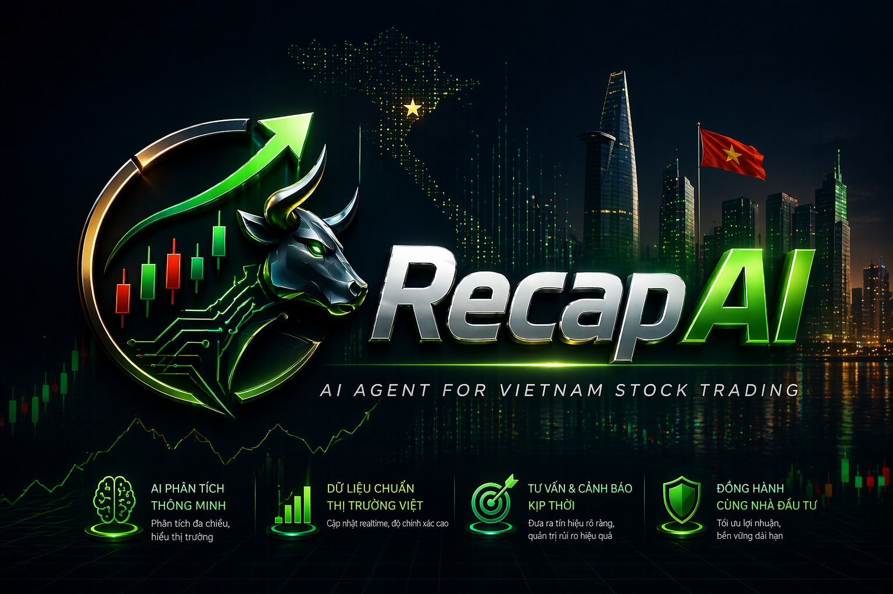

<p align="center">
  
</p>

# RECAPAI

Backend service built with FastAPI, Socket.IO, MongoDB, Redis, LangChain, and LangGraph.

This repository is the API and realtime backend for a multi-tenant AI application. It combines classic business endpoints with AI-powered workflows such as chat, lead-agent orchestration, stock data, meeting transcription, voice cloning, TTS, image generation, and Google Sheets sync.

## What the service does

- JWT authentication with bootstrap flow for the first super admin
- Multi-organization access control using `X-Organization-ID`
- AI chat conversations with background response processing
- Lead-agent conversations with runtime selection, skills, tools, and plan retrieval
- Stock catalog, company data, price history, intraday data, watchlists, and backtests
- Google Sheets connection management and async sheet sync
- Meeting management plus realtime speech-to-text and note generation
- Voice cloning and text-to-speech generation
- Image upload and async image generation
- Analytics endpoints built on synchronized sheet data

## Architecture at a glance

- REST API: FastAPI routers mounted under `/api/v1`
- Realtime transport: Socket.IO mounted on the same ASGI app
- Persistence: MongoDB for application data and LangGraph checkpointing
- Queue and fan-out: Redis for queues and optional Socket.IO scaling
- AI orchestration: LangChain and LangGraph
- External providers:
  - OpenAI and Azure OpenAI for LLM access
  - Deepgram for speech-to-text
  - MiniMax for voice and audio generation
  - Cloudinary for media storage
  - Google Sheets service account for sheet sync
  - vnstock for Vietnam stock market data
  - DDGS MCP server for web research tools

## Runtime requirements

The current settings model requires these services or credentials at startup:

- MongoDB
- Redis
- JWT secret and internal API key
- Google service account credentials
- Cloudinary credentials
- Deepgram API key
- MiniMax API key
- vnstock API key

Some AI endpoints also need LLM configuration such as `OPENAI_API_KEY` or Azure OpenAI settings.

Source of truth for required environment variables is [app/config/settings.py](app/config/settings.py).

## Quick start

### 1. Create a virtual environment

```bash
python -m venv .venv
```

Activate it in your shell, then install dependencies:

```bash
pip install -r requirements.txt
```

### 2. Configure environment variables

Start from `.env.example`:

```bash
Copy-Item .env.example .env
```

or on Unix-like shells:

```bash
cp .env.example .env
```

Then fill in the required values. The app currently expects, at minimum:

```env
JWT_SECRET_KEY=
INTERNAL_API_KEY=
MONGODB_URI=mongodb://localhost:27017
MONGODB_DB_NAME=ai_service
REDIS_URL=redis://localhost:6379

GOOGLE_SERVICE_ACCOUNT_JSON=
GOOGLE_SERVICE_ACCOUNT_EMAIL=

OPENAI_API_KEY=
AZURE_OPENAI_API_KEY=
AZURE_OPENAI_ENDPOINT=
AZURE_OPENAI_API_VERSION=
AZURE_OPENAI_LEGACY_CHAT_DEPLOYMENT=

MINIMAX_API_KEY=
DEEPGRAM_API_KEY=

CLOUDINARY_CLOUD_NAME=
CLOUDINARY_API_KEY=
CLOUDINARY_API_SECRET=

VNSTOCK_API_KEY=
```

Notes:

- `.env.example` is only a starting point. `app/config/settings.py` is the authoritative reference.
- `REDIS_URL` is used by the API process and background workers.
- If you only configure one LLM provider, configure the routes and features that depend on that provider accordingly.

### 3. Start infrastructure

You need MongoDB and Redis running before starting the API.

Example local defaults used by the app:

- MongoDB: `mongodb://localhost:27017`
- Redis: `redis://localhost:6379`

### 4. Run the API

```bash
uvicorn app.main:combined_app --reload --port 8080
```

Important details:

- REST API base path: `http://localhost:8080/api/v1`
- Swagger UI: `http://localhost:8080/docs`
- ReDoc: `http://localhost:8080/redoc`
- Socket.IO is mounted on the same server root

### 5. Run background workers

Some features rely on Redis-backed workers.

Image generation worker:

```bash
python -m app.workers.image_generation_worker
```

Meeting note worker:

```bash
python -m app.workers.meeting_note_worker
```

Sheet sync worker:

```bash
python -m app.workers.sheet_sync_worker
```

Stock research worker:

```bash
python -m app.workers.stock_research_worker
```

### 6. Run tests

```bash
pytest
```

## MCP web search setup

The application uses MCP for web research tools. The default provider is the official DDGS MCP server launched from the app environment via:

```bash
ddgs mcp
```

Install the dependency into the same Python environment as the app:

```bash
pip install "ddgs[mcp]"
```

Notes:

- `requirements.txt` already includes `ddgs[mcp]`
- DDGS supports proxy configuration via the inherited `DDGS_PROXY` environment variable
- Direct invocations can also pass an explicit proxy argument, for example:

```bash
ddgs mcp -pr socks5h://127.0.0.1:9150
```

- The application-level research contract remains `search` and `fetch_content`, while the underlying MCP provider can change later if tool normalization is preserved

## API conventions

### Authentication

Typical first-time bootstrap flow:

1. `POST /api/v1/auth/bootstrap-super-admin`
2. `POST /api/v1/auth/login`
3. Use the returned bearer token in `Authorization: Bearer <token>`

### Organization scoping

Most business and AI routes require:

- `Authorization: Bearer <token>`
- `X-Organization-ID: <organization-id>`

If `X-Organization-ID` is missing, the API returns `400`.

### Internal endpoints

Routes under `/api/v1/internal` are intended for internal automation or scheduler use and require the `X-API-Key` header to match `INTERNAL_API_KEY`.

## Main route groups


| Route group                 | Purpose                                                              |
| --------------------------- | -------------------------------------------------------------------- |
| `/api/v1/health`            | Basic health check                                                   |
| `/api/v1/auth`              | Login, password change, bootstrap super admin                        |
| `/api/v1/users`             | User management and current-user queries                             |
| `/api/v1/organizations`     | Organization CRUD and membership management                          |
| `/api/v1/chat`              | AI conversation messaging and history                                |
| `/api/v1/lead-agent`        | Lead-agent messaging, plan retrieval, skills, tools, runtime catalog |
| `/api/v1/sheet-connections` | Google Sheets connection CRUD, preview, data access, sync status     |
| `/api/v1/stocks`            | Stock catalog, company tabs, price history, intraday data            |
| `/api/v1/stocks/watchlists` | Watchlist CRUD and watchlist items                                   |
| `/api/v1/backtests`         | Backtest templates and execution                                     |
| `/api/v1/analytics`         | Analytics endpoints over synchronized data                           |
| `/api/v1/images`            | Image upload and asset management                                    |
| `/api/v1/image-generations` | Async image generation jobs                                          |
| `/api/v1/voices`            | Voice clone, voice list, preview, delete                             |
| `/api/v1/tts`               | Generate audio, stream audio, list audio assets                      |
| `/api/v1/meetings`          | Meeting listing, metadata updates, utterances, note chunks           |
| `/api/v1/internal`          | Internal triggers such as sync kickoff                               |


## Realtime behavior

The ASGI entrypoint is `app.main:combined_app`, which combines FastAPI and Socket.IO.

Socket.IO is used for:

- Streaming AI responses back to the client
- Live speech-to-text sessions
- Meeting recording and note-generation workflows
- Realtime TTS streaming

Connection auth uses the same JWT token model as the REST API.

## Project structure

```text
ai_service_kiro/
|-- app/
|   |-- main.py                 # FastAPI + Socket.IO entrypoint
|   |-- api/                    # REST routers and dependencies
|   |-- agents/                 # AI agents, including lead-agent
|   |-- services/               # Application and domain services
|   |-- infrastructure/         # External providers and integrations
|   |-- repo/                   # Data-access repositories
|   |-- domain/                 # Models and API schemas
|   |-- socket_gateway/         # Socket.IO auth, server, and gateway logic
|   |-- workers/                # Background worker entrypoints
|   `-- config/                 # Settings, logging, MCP config
|-- doc/                        # Frontend integration guides and feature docs
|-- scripts/                    # Helper scripts and local run helpers
|-- tests/                      # Unit and integration tests
|-- requirements.txt
`-- README.md
```

## Feature-specific docs

The `doc/feature` directory contains integration notes for consumers of this backend. Useful starting points:

- [Backtest frontend guide](doc/feature/backtest/frontend_integration_guide.md)
- [Meeting frontend guide](doc/feature/meeting/frontend_integration_guide.md)
- [Meeting management guide](doc/feature/meeting/meeting_management_frontend_guide.md)
- [Live STT frontend guide](doc/feature/s2t/live_speech_to_text_frontend_guide.md)
- [Stocks frontend guide](doc/feature/stocks/frontend_integration_guide.md)
- [Stock company guide](doc/feature/stocks/stock_company_frontend_guide.md)
- [Stock price guide](doc/feature/stocks/stock_price_frontend_guide.md)
- [Stock research runtime metadata guide](doc/feature/stocks/stock_research_runtime_metadata_frontend_guide.md)
- [Stock watchlist guide](doc/feature/stocks/stock_watchlist_frontend_guide.md)
- [Lead-agent skill guide](doc/feature/skill/lead_agent_skill_frontend_guide.md)
- [Lead-agent catalog guide](doc/feature/skill/lead_agent_catalog_frontend_guide.md)
- [Lead-agent subagent guide](doc/feature/subagent/lead_agent_subagent_frontend_guide.md)

## Notes for contributors

- The current repository has both REST and realtime concerns in the same service. Changes often need to consider both API and Socket.IO flows.
- A large portion of the business logic is organization-scoped. Check auth and membership requirements before adding new endpoints.
- If you add or change environment variables, update both `app/config/settings.py` and `.env.example`.

