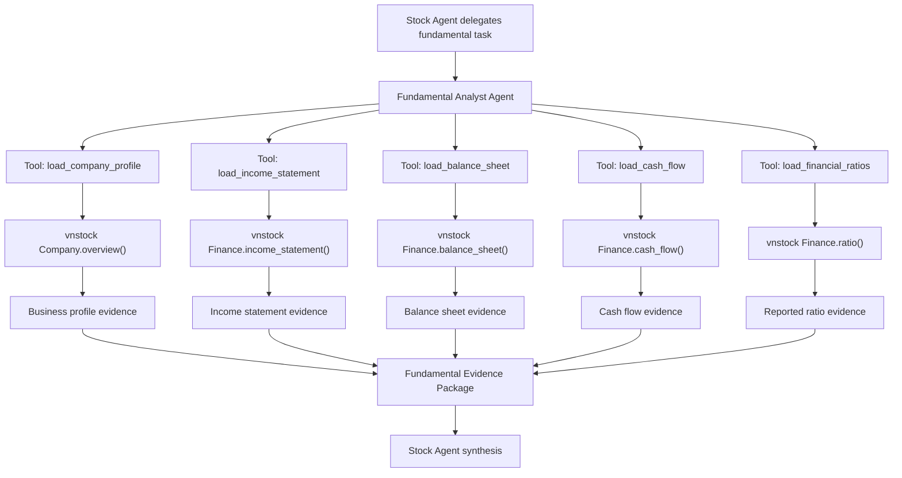
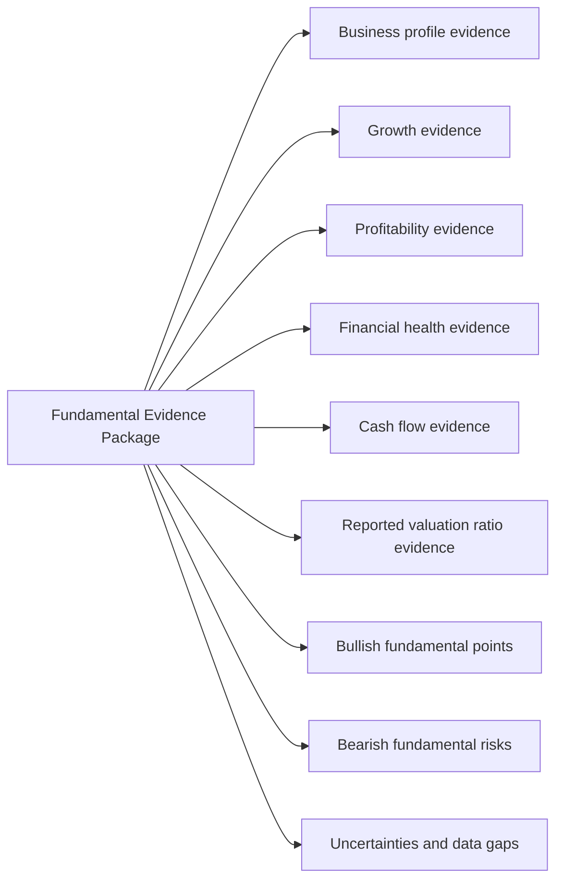

# Fundamental Analyst Agent Graph

The Fundamental Analyst Agent answers this question: is the underlying business financially healthy, improving or deteriorating, and reasonably valued relative to its quality and reported financial evidence?

It returns a synthesis-ready evidence package to the parent Stock Agent. It does not produce the final user-facing buy/sell/reduce/accumulate recommendation.

Phase one deliberately excludes company news, corporate events, policy, macro, and industry-event research because that scope belongs to the News & Event Analyst Agent.

Phase one also deliberately excludes deterministic metric computation because the current financial statement item contract is not stable enough. The agent should work from compact selected evidence and explicitly report data gaps.

## Phase-one tools

| Tool | vnstock source | Purpose | Output shape |
|---|---|---|---|
| `load_company_profile` | `Company.overview()` | Load basic business profile only. | Company profile, industry, charter capital, issue shares, source metadata, data gaps. |
| `load_income_statement` | `Finance.income_statement()` | Load compact income statement evidence. | Selected income rows, period labels, raw item names, raw item IDs, values by period, missing expected items, source metadata, partial failure. |
| `load_balance_sheet` | `Finance.balance_sheet()` | Load compact balance sheet evidence. | Selected balance sheet rows, period labels, raw item names, raw item IDs, values by period, missing expected items, source metadata, partial failure. |
| `load_cash_flow` | `Finance.cash_flow()` | Load compact cash flow statement evidence. | Selected cash flow rows, period labels, raw item names, raw item IDs, values by period, missing expected items, source metadata, partial failure. |
| `load_financial_ratios` | `Finance.ratio()` | Load compact reported financial ratio evidence. | Selected ratio rows, period labels, raw item names, raw item IDs, values by period, missing expected items, source metadata, partial failure. |

## Six fundamental jobs

| # | Fundamental job | Tool(s) | What the agent should produce |
|---|---|---|---|
| 1 | Understand the business | `load_company_profile` | Basic business context from `Company.overview()`. |
| 2 | Analyze growth | `load_income_statement`, optionally `load_financial_ratios` | Growth evidence from reported revenue/profit/EPS rows. |
| 3 | Analyze profitability | `load_income_statement`, `load_financial_ratios` | Profitability evidence from reported income statement and ratio rows. |
| 4 | Analyze financial health | `load_balance_sheet`, `load_financial_ratios` | Financial health evidence from reported balance sheet and leverage/liquidity ratio rows. |
| 5 | Analyze cash flow quality | `load_cash_flow`, optionally `load_income_statement` | Cash flow quality evidence from reported cash flow rows and net profit context. |
| 6 | Analyze reported valuation ratios | `load_financial_ratios` | Reported valuation evidence such as P/E, P/B, EPS, and related ratio rows when available. |

## Tool routing guidance

| User asks about | Prefer tool(s) |
|---|---|
| Business model, company profile, industry | `load_company_profile` |
| Revenue, profit, EPS, growth | `load_income_statement` |
| Margins, ROE, ROA, profitability ratios | `load_income_statement`, `load_financial_ratios` |
| Assets, liabilities, equity, leverage, liquidity | `load_balance_sheet`, `load_financial_ratios` |
| Operating cash flow, investing cash flow, financing cash flow | `load_cash_flow` |
| Cash flow quality compared with profit context | `load_cash_flow`, `load_income_statement` |
| P/E, P/B, EPS, reported valuation ratios | `load_financial_ratios` |

## Recommended phase-one output

Phase one should stop at a fundamental evidence package. It should not claim intrinsic value, target price, or computed metric precision until item IDs, sector templates, peer data, forecast assumptions, and deterministic metric logic are added.
