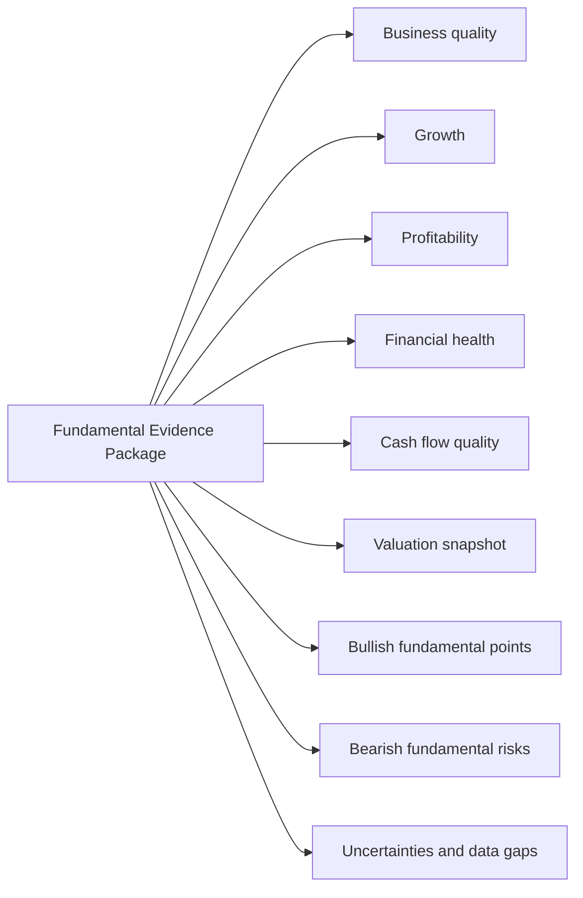

# Fundamental Analyst Agent Graph

The Fundamental Analyst Agent answers this question: is the underlying business financially healthy, improving or deteriorating, and reasonably valued relative to its quality and risks?

It should return a synthesis-ready evidence package to the parent Stock Agent. It does not produce the final user-facing buy/sell/reduce/accumulate recommendation.

Phase one deliberately excludes company news, corporate events, policy, macro, and industry-event research because that scope belongs to the News & Event Analyst Agent.

```mermaid
flowchart TD
    A["Stock Agent delegates fundamental task"] --> B["Fundamental Analyst Agent"]

    B --> C["1. Understand the business"]
    B --> D["2. Analyze growth"]
    B --> E["3. Analyze profitability"]
    B --> F["4. Analyze financial health"]
    B --> G["5. Analyze cash flow quality"]
    B --> H["6. Analyze valuation snapshot"]

    C --> C1["vnstock Company.overview()"]

    D --> D1["vnstock Finance.income_statement period quarter or year"]
    D --> D2["Revenue, net profit, EPS, YoY/QoQ trends"]

    E --> E1["vnstock Finance.income_statement period quarter or year"]
    E --> E2["vnstock Finance.ratio period quarter or year"]
    E --> E3["Gross margin, net margin, ROE, ROA"]

    F --> F1["vnstock Finance.balance_sheet period quarter or year"]
    F --> F2["vnstock Finance.ratio period quarter or year"]
    F --> F3["Debt/equity, current ratio, assets, liabilities, equity"]

    G --> G1["vnstock Finance.cash_flow period quarter or year"]
    G --> G2["Operating cash flow, investing cash flow, financing cash flow"]
    G --> G3["CFO vs net income, FCF proxy when available"]

    H --> H1["vnstock Finance.ratio period quarter or year"]
    H --> H2["vnstock Company.ratio_summary()"]
    H --> H3["vnstock Company.trading_stats()"]
    H --> H4["P/E, P/B, EPS, EV, market/price snapshot when available"]

    C1 --> J["Fundamental Evidence Package"]
    D1 --> J
    E1 --> J
    F1 --> J
    G1 --> J
    H1 --> J

    J --> K["Stock Agent synthesis"]
```

## Six jobs and vnstock data mapping

| # | Fundamental Analyst job | Primary vnstock data | What to extract | Notes |
|---|---|---|---|---|
| 1 | Understand the business | `Company.overview()` | Company profile, industry, charter capital, issue shares | Keep phase one narrow. Do not load shareholders, officers, subsidiaries, affiliates, news, events, or reports. |
| 2 | Analyze growth | `Finance.income_statement(period="quarter"|"year")` | Revenue, gross profit, operating profit, net profit, EPS, revenue growth, profit growth | Prefer both annual trend and recent quarterly trend when available. |
| 3 | Analyze profitability | `Finance.income_statement(...)`, `Finance.ratio(...)` | Gross margin, operating margin, net margin, ROE, ROA, EPS | Use report rows and ratios together; do not infer missing margins from unavailable rows. |
| 4 | Analyze financial health | `Finance.balance_sheet(...)`, `Finance.ratio(...)` | Cash, current assets, total assets, liabilities, equity, debt/equity, current ratio, quick ratio | Sector-specific interpretation is required for banks, securities, insurers, and real estate. |
| 5 | Analyze cash flow quality | `Finance.cash_flow(...)` | Operating cash flow, investing cash flow, financing cash flow, cash ending balance, FCF proxy if available | Compare operating cash flow against net profit to detect earnings-quality risk. |
| 6 | Analyze valuation snapshot | `Finance.ratio(...)`, `Company.ratio_summary()`, `Company.trading_stats()` | P/E, P/B, EPS, dividend, EV, match/close price, issue shares, market snapshot | This supports valuation context, not a full target price. Full valuation needs peers, forecasts, and assumptions. |

## Recommended phase-one output

Phase one should stop at a fundamental evidence package. It should not claim intrinsic value or target price unless peer data, forecast assumptions, and sector-specific valuation logic are added.
