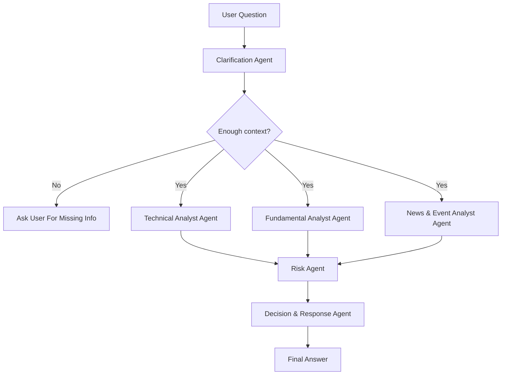

```mermaid
flowchart TD
    A["User Question"] --> B["Clarification Agent"]

    B --> C{"Enough context?"}

    C -->|No| D["Ask User For Missing Info"]
    C -->|Yes| E["Technical Analyst Agent"]
    C -->|Yes| F["Fundamental Analyst Agent"]
    C -->|Yes| G["News & Event Analyst Agent"]

    E --> H["Risk Agent"]
    F --> H
    G --> H

    H --> I["Decision & Response Agent"]
    I --> J["Final Answer"]
```
