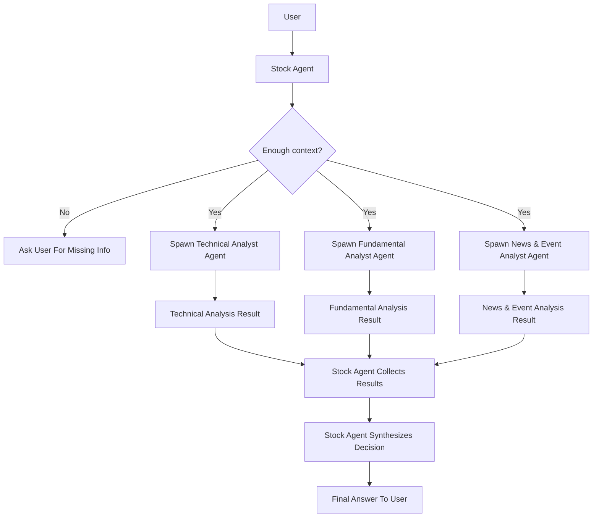

```mermaid
flowchart TD
    A["User"] --> B["Stock Agent"]

    B --> C{"Enough context?"}

    C -->|No| D["Ask User For Missing Info"]
    C -->|Yes| E["Spawn Technical Analyst Agent"]
    C -->|Yes| F["Spawn Fundamental Analyst Agent"]
    C -->|Yes| G["Spawn News & Event Analyst Agent"]

    E --> H["Technical Analysis Result"]
    F --> I["Fundamental Analysis Result"]
    G --> J["News & Event Analysis Result"]

    H --> K["Stock Agent Collects Results"]
    I --> K
    J --> K

    K --> L["Stock Agent Synthesizes Decision"]
    L --> M["Final Answer To User"]
```
