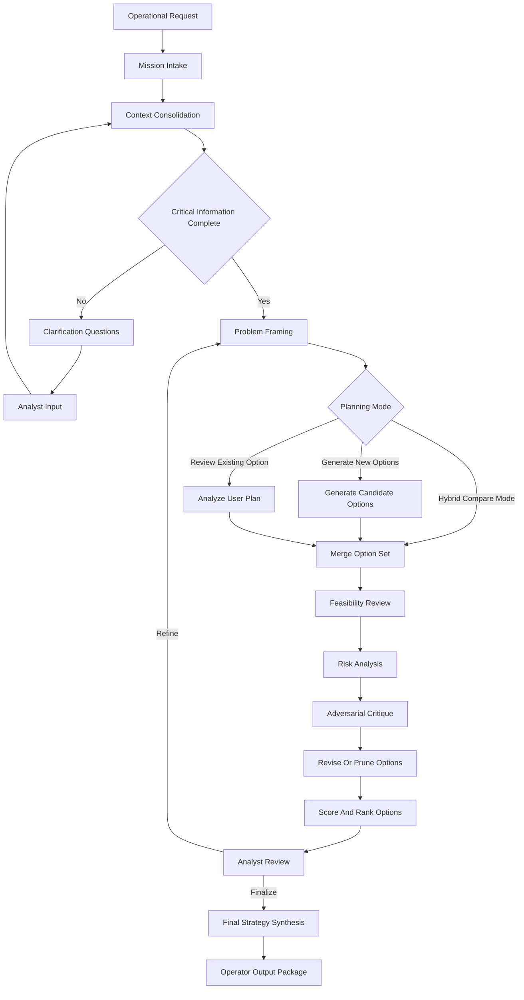
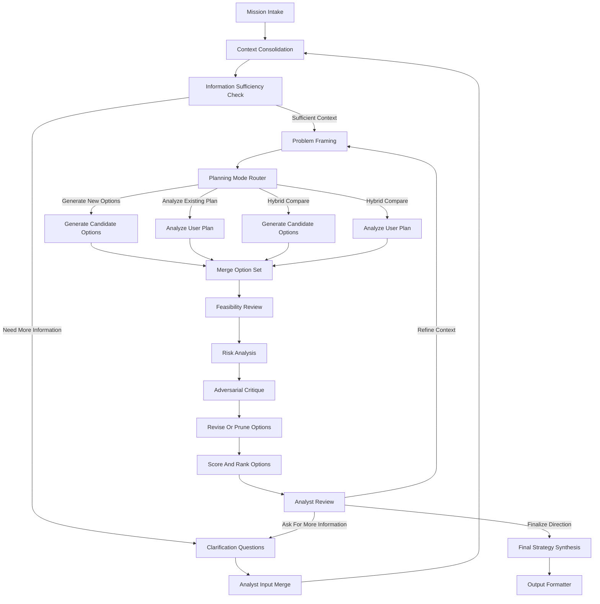
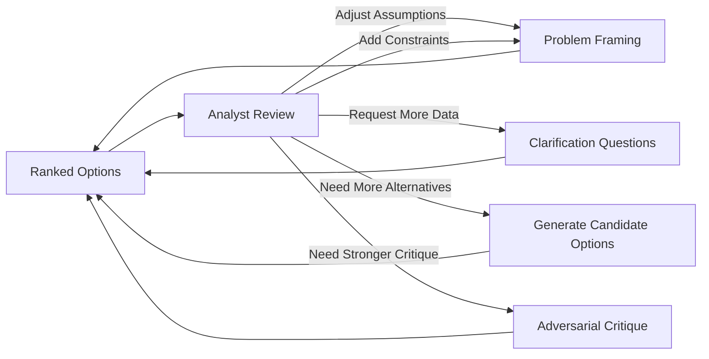
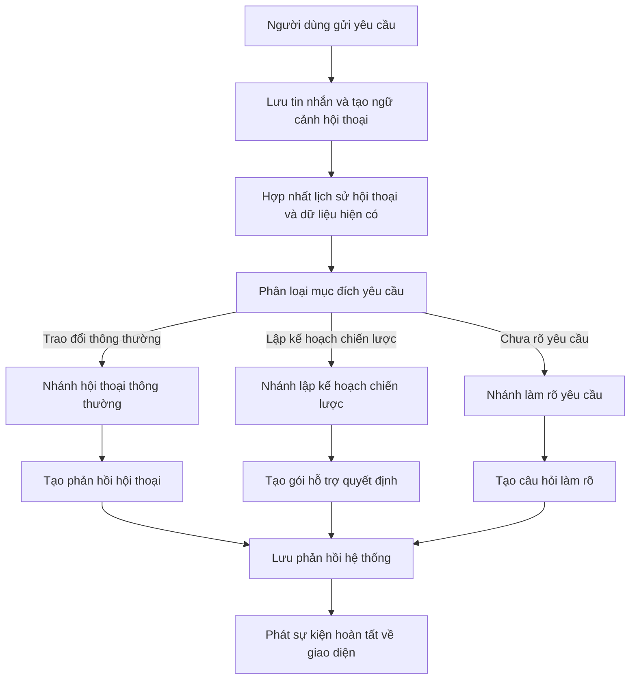
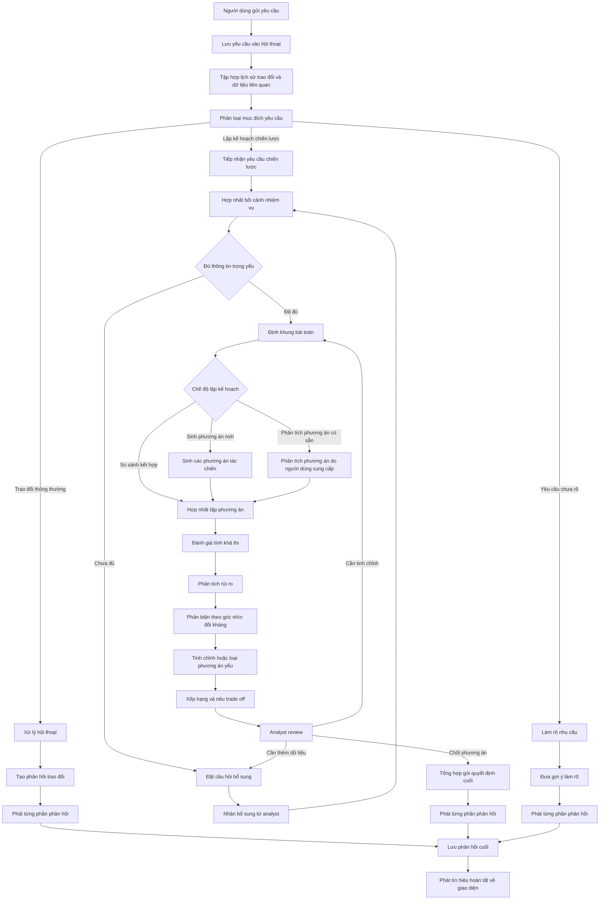
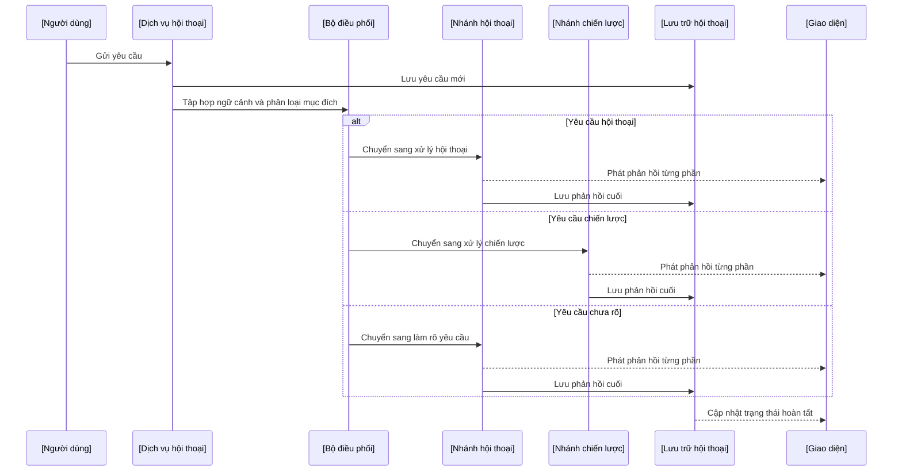

# Military Strategic Planning Graph

## Mục tiêu

Thiết kế một `LangGraph` workflow cho AI agent hỗ trợ phân tích chiến lược quân sự và an ninh, tập trung vào:

- Sinh nhiều phương án tác chiến
- Phân tích và phản biện phương án do analyst hoặc người dùng nhập
- Tương tác nhiều vòng để hội tụ về phương án tốt nhất
- Trả ra gói quyết định đầy đủ gồm khuyến nghị, phương án thay thế, rủi ro, phân bổ nguồn lực, timeline, và phản biện đối kháng

Workflow này là hệ thống `decision-support`, không phải hệ thống thực thi tự động.

## Định hướng kiến trúc

Không nên dùng một `ReAct agent` duy nhất làm planner trung tâm cho bài toán này. Lý do:

- Khó kiểm soát đường đi của reasoning
- Khó audit assumptions và decision points
- Khó ép agent sinh nhiều phương án khác biệt thật sự
- Khó tách biệt bước sinh phương án và bước phản biện, chấm điểm

Kiến trúc phù hợp hơn là:

- Một `parent StateGraph` điều phối toàn bộ flow
- Các node đơn nhiệm, mỗi node sinh ra artifact có cấu trúc rõ ràng
- Có `human-in-the-loop` tại các decision boundary quan trọng
- Có vòng lặp refinement khi analyst muốn thêm thông tin hoặc chỉnh hướng

## Kiến trúc tổng thể



## Khuyến nghị triển khai trong codebase hiện tại

Nên tạo workflow mới độc lập:

- `strategic_planning_workflow`

Không nên nhét toàn bộ feature vào `chat_workflow` hiện tại. Thay vào đó:

- Reuse pattern `StateGraph` registry đang có
- Reuse cách compile workflow qua graph factory
- Reuse cơ chế streaming event ra socket
- Reuse clarify pattern, nhưng nâng cấp từ clarify hội thoại sang clarify chiến lược

### Cách tích hợp đề xuất

1. Tạo `strategic_planning_workflow` như một workflow riêng trong `app/graphs/workflows/`
2. Thêm một lớp router ở tầng trên để quyết định khi nào route sang strategic planning
3. Giữ `chat_workflow` cho conversational flow hiện tại
4. Chỉ dùng `create_react_agent` như specialist node nếu tương lai cần tool-based sub-agent, không dùng làm orchestrator chính

## Nguyên tắc thiết kế graph

- `Deterministic outer graph`: luồng chính phải nhìn thấy rõ
- `Structured artifacts`: mọi node quan trọng trả về object có schema rõ ràng
- `Clarification-first`: thiếu dữ liệu phải hỏi lại trước khi planning sâu
- `Generation != Evaluation`: sinh phương án phải tách khỏi chấm điểm và phản biện
- `Human-in-the-loop`: analyst quyết định tại các mốc quan trọng
- `Bounded loops`: giới hạn số vòng lặp refinement để kiểm soát chi phí
- `Auditability`: luôn lưu assumptions, open questions, rejected options

## State đề xuất

State của workflow nên có các trường chính sau:

```text
messages
user_id
conversation_id
mission_request
planning_mode
mission_context
known_facts
missing_information
assumptions
planning_objectives
constraints
success_criteria
candidate_options
user_plan_analysis
feasibility_findings
risk_register
red_team_findings
ranked_options
analyst_feedback
selected_direction
final_strategy
output_package
tool_calls
error
```

### Ý nghĩa state

- `mission_request`: yêu cầu gốc của người dùng
- `planning_mode`: generate mới, review plan có sẵn, hoặc hybrid compare
- `mission_context`: mission brief chuẩn hóa
- `known_facts`: dữ kiện đã xác nhận
- `missing_information`: thông tin còn thiếu nhưng có ảnh hưởng đến chất lượng plan
- `assumptions`: giả định tạm dùng khi analyst chưa cung cấp đủ dữ liệu
- `candidate_options`: danh sách phương án tác chiến
- `risk_register`: danh sách rủi ro theo từng phương án
- `red_team_findings`: các phản biện đối kháng
- `ranked_options`: danh sách phương án đã xếp hạng
- `selected_direction`: hướng analyst muốn tiếp tục refine hoặc finalize
- `output_package`: dữ liệu cuối cùng render cho UI hoặc API

## Node-by-node solution

### 1. Mission Intake

Mục tiêu:

- Nhận yêu cầu ban đầu từ analyst hoặc người dùng
- Xác định đây là bài toán sinh plan mới hay review plan có sẵn
- Chuẩn hóa input thô thành một mission request nhất quán

Input:

- `messages`
- tài liệu hoặc input mô tả tình huống

Output:

- `mission_request`
- `planning_mode`

### 2. Context Consolidation

Mục tiêu:

- Gộp toàn bộ dữ liệu hiện có thành mission brief dùng chung
- Tách rõ phần chắc chắn, phần chưa chắc, phần thiếu

Input:

- `mission_request`
- dữ liệu người dùng cung cấp

Output:

- `mission_context`
- `known_facts`
- `missing_information`
- `assumptions`

### 3. Information Sufficiency Check

Mục tiêu:

- Đánh giá xem đã đủ thông tin tối thiểu để planning sâu hay chưa
- Chỉ ra những thiếu hụt có tác động lớn đến quyết định

Output:

- `needs_clarification`
- `missing_information`

### 4. Clarification Questions

Mục tiêu:

- Sinh các câu hỏi bổ sung thông tin ngắn gọn và có giá trị cao
- Không hỏi lan man

Output:

- danh sách câu hỏi cần analyst trả lời
- danh sách assumptions nếu người dùng muốn tiếp tục dù chưa đủ dữ liệu

### 5. Analyst Input Merge

Mục tiêu:

- Nhận phản hồi bổ sung
- Cập nhật lại mission context

Output:

- `mission_context` mới
- `known_facts` mới
- `missing_information` mới

### 6. Problem Framing

Mục tiêu:

- Chuyển mission context sang planning schema chuẩn để mọi node sau dùng chung

Nội dung cần framing:

- mục tiêu chiến lược
- mục tiêu tác chiến
- giới hạn vận hành
- nguồn lực
- thời gian
- điều kiện thành công
- các giả định trọng yếu

Output:

- `planning_objectives`
- `constraints`
- `success_criteria`
- framing summary

### 7. Planning Mode Router

Mục tiêu:

- Route sang đúng flow con theo loại yêu cầu

Các nhánh:

- `generate_new_options`
- `analyze_existing_plan`
- `hybrid_compare`

### 8. Generate Candidate Options

Mục tiêu:

- Sinh từ `3` đến `5` phương án đủ khác biệt
- Mỗi phương án phải bao gồm cả tấn công, phòng thủ, nguồn lực, timeline, và rationale

Mỗi option nên có cấu trúc:

- strategic intent
- offensive concept
- defensive concept
- required resources
- timeline and phases
- expected benefits
- key dependencies
- initial weaknesses

Output:

- `candidate_options`

### 9. Analyze User Plan

Mục tiêu:

- Chuẩn hóa phương án do analyst cung cấp thành cùng schema với option do hệ thống sinh
- Chỉ ra điểm mạnh, điểm yếu, thiếu sót, phụ thuộc ẩn

Output:

- `user_plan_analysis`
- phương án analyst ở format chuẩn hóa

### 10. Merge Option Set

Mục tiêu:

- Hợp nhất option do hệ thống sinh và option do analyst cung cấp vào cùng một bộ để đánh giá

Output:

- `candidate_options` đã được normalize

### 11. Feasibility Review

Mục tiêu:

- Kiểm tra tính khả thi của từng phương án dựa trên dữ liệu hiện có

Các góc kiểm tra:

- nguồn lực
- thời gian
- phụ thuộc liên hoàn
- mức độ phù hợp với objective
- điểm mâu thuẫn nội tại

Output:

- `feasibility_findings`

### 12. Risk Analysis

Mục tiêu:

- Lập risk register cho từng phương án

Nhóm rủi ro:

- operational risk
- timing risk
- coordination risk
- escalation risk
- uncertainty risk

Output:

- `risk_register`

### 13. Adversarial Critique

Mục tiêu:

- Đóng vai đối phương để công kích từng phương án
- Tìm failure points và second-order effects

Các câu hỏi phản biện trọng tâm:

- đối phương có thể phản ứng thế nào
- phương án phụ thuộc vào điểm dễ bị khai thác nào
- đâu là điểm vỡ dây chuyền
- đâu là lỗ hổng do thông tin bất cân xứng

Output:

- `red_team_findings`

### 14. Revise Or Prune Options

Mục tiêu:

- Cập nhật những phương án còn cứu được
- Loại bỏ phương án yếu hoặc trùng lặp

Output:

- shortlist options
- rejected options

### 15. Score And Rank Options

Mục tiêu:

- Xếp hạng phương án trên tiêu chí minh bạch

Tiêu chí gợi ý:

- mission fit
- feasibility
- resilience
- resource efficiency
- timeline realism
- downside exposure

Output:

- `ranked_options`
- lý do xếp hạng

### 16. Analyst Review

Mục tiêu:

- Cho analyst xem assumptions, phương án mạnh nhất, trade-off, và rủi ro
- Analyst có thể yêu cầu chạy lại một phần flow

Các hành động có thể xảy ra:

- refine assumptions
- add constraints
- ask for more options
- request deeper critique
- choose one direction to finalize

Output:

- `analyst_feedback`
- `selected_direction`

### 17. Final Strategy Synthesis

Mục tiêu:

- Tạo gói khuyến nghị cuối cùng cho operator

Nội dung cần có:

- recommended strategy
- runner-up options
- attack plan
- defense plan
- resource allocation
- timeline and phasing
- risk summary
- red-team summary
- open assumptions
- unresolved questions

Output:

- `final_strategy`

### 18. Output Formatter

Mục tiêu:

- Render về format ổn định để API và UI dễ dùng

Output schema nên gồm:

- executive summary
- mission brief
- ranked options
- selected recommendation
- attack and defense package
- risk package
- analyst notes
- assumptions and open questions

## Graph chi tiết node-by-node



## Vòng lặp refinement

Workflow này phải hỗ trợ refinement loop theo analyst feedback.



## Quy tắc routing chính

### Route 1: đủ thông tin hay chưa

- Nếu thiếu thông tin chặn quyết định, vào clarify loop
- Nếu đủ thông tin tối thiểu, tiếp tục planning

### Route 2: kiểu planning

- Nếu user muốn hệ thống tự sinh phương án mới, đi vào nhánh generate
- Nếu user đã có phương án, đi vào nhánh analyze
- Nếu user muốn so sánh phương án có sẵn với phương án hệ thống sinh ra, đi vào hybrid compare

### Route 3: analyst review

- Nếu analyst chưa hài lòng, loop lại theo đúng điểm cần sửa
- Nếu analyst chốt hướng, vào synthesis

## Tại sao không dùng một agent duy nhất

Không khuyến nghị một agent duy nhất cho strategic planning vì:

- reasoning path bị ẩn
- khó tách generation khỏi critique
- khó lưu artifacts trung gian
- khó tạo audit trail rõ ràng
- khó kiểm soát số vòng suy luận và chi phí

`ReAct agent` vẫn có thể hữu ích ở tương lai như specialist node:

- research helper
- doctrine summarizer
- intelligence extractor
- external signal collector

Nhưng orchestration chính vẫn nên là `StateGraph`.

## Chiến lược triển khai theo phase

### Phase 1

- Xây parent graph
- Hoàn thiện intake, clarification, framing
- Sinh candidate options
- Risk analysis
- Analyst review
- Final synthesis

### Phase 2

- Thêm adversarial critique mạnh hơn
- Thêm ranking minh bạch hơn
- Thêm hybrid compare mode hoàn chỉnh

### Phase 3

- Thêm retrieval doctrine hoặc intelligence
- Thêm constraint engine riêng
- Thêm simulation hoặc war-gaming engine

## Quy tắc chất lượng cho V1

- Mỗi node phải có input và output schema rõ ràng
- Luôn lưu assumptions và open questions
- Không cho phép synthesis khi chưa qua analyst review
- Giới hạn số option mỗi vòng để kiểm soát chi phí
- Giới hạn số vòng refinement để tránh loop vô hạn

## Kết luận

Thiết kế phù hợp nhất cho feature này là:

- Một `strategic_planning_workflow` độc lập
- Dùng `LangGraph StateGraph` làm orchestrator
- Tách riêng generation, evaluation, critique, ranking, và synthesis
- Có clarify loop để hỏi thêm dữ liệu
- Có analyst review gate làm human-in-the-loop trung tâm

Đây là nền tảng tốt cho V1 decision-support, đồng thời vẫn mở đường cho V2 với retrieval, simulation, và tooling phức tạp hơn.

## Full System Graph Từ Đầu Đến Cuối

Phần trên tập trung vào `strategic_planning_workflow`. Tuy nhiên ở cấp sản phẩm, hệ thống thực tế cần một graph lớn hơn để bao quát đầy đủ:

- normal chat
- strategic planning
- clarify flow
- analyst review loop
- final persistence và client output

Mục tiêu của full graph là đảm bảo từ khi người dùng gửi yêu cầu đến khi phản hồi hoàn tất, mọi đường đi đều rõ ràng và có thể audit.

### Kiến trúc full graph đề xuất



### Vai trò từng node trong full graph

#### 1. User Request Intake

Vai trò:

- nhận input mới từ người dùng
- xác định conversation hiện tại hay conversation mới
- tạo điểm bắt đầu cho toàn bộ graph

Output chính:

- nội dung tin nhắn hiện tại
- `conversation_id`
- `user_id`

#### 2. Message Persistence

Vai trò:

- lưu tin nhắn người dùng vào hệ thống trước khi chạy agent
- đảm bảo traceability cho mọi lần chạy

Output chính:

- lịch sử tin nhắn đã cập nhật

#### 3. Context Assembly

Vai trò:

- lấy lịch sử hội thoại gần nhất
- lấy dữ liệu nghiệp vụ liên quan nếu có
- hợp nhất thành state ban đầu

Output chính:

- `messages`
- dữ liệu operational context
- metadata phục vụ routing

#### 4. Intent Classification

Vai trò:

- xác định yêu cầu hiện tại thuộc nhóm nào

Các nhóm nên hỗ trợ:

- `normal_chat`
- `strategic_planning`
- `unclear`

Lưu ý:

- với định hướng mới, nên tinh gọn classifier theo `normal_chat`, `strategic_planning`, `unclear`
- full system graph của feature này không còn nhánh phân tích dữ liệu riêng

#### 5. Route To Conversation Branch

Vai trò:

- xử lý các câu hỏi thông thường, chào hỏi, hỏi khả năng hệ thống, hoặc trao đổi chung

Node con nên gồm:

- conversation response generation
- optional web search support
- streaming tokens về client

#### 6. Route To Strategic Planning Branch

Vai trò:

- chuyển sang graph planning chuyên biệt cho military decision-support

Node con chính:

- mission intake
- context consolidation
- information sufficiency check
- clarification
- problem framing
- planning mode routing
- option generation hoặc plan analysis
- feasibility review
- risk analysis
- adversarial critique
- revise and prune
- score and rank
- analyst review
- final strategy synthesis
- output formatting

#### 7. Route To Clarification Branch

Vai trò:

- xử lý khi intent chưa rõ
- giúp người dùng reformulate yêu cầu
- sau khi có thêm thông tin, request mới sẽ quay lại classifier ở lượt sau

#### 8. Response Persistence

Vai trò:

- lưu phản hồi cuối cùng của hệ thống
- đảm bảo mọi branch đều có đầu ra thống nhất

#### 9. Completion Event

Vai trò:

- phát tín hiệu hoàn tất cho frontend hoặc socket client
- thống nhất behavior dù branch nào được chọn

## Full System Graph Chi Tiết Với Các Nhánh Con



## Mapping Từ Full Graph Sang Các Workflow Thực Tế

Để dễ triển khai, nên chia full graph thành `3` tầng:

### Tầng 1: Conversation Orchestrator

Phụ trách:

- intake
- persistence
- context assembly
- intent classification
- route tới branch phù hợp
- lưu output cuối

Workflow này là parent graph ở cấp ứng dụng.

### Tầng 2: Branch Workflows

Gồm hai workflow con chính:

- `normal_chat_workflow`
- `strategic_planning_workflow`

Ngoài ra có thể giữ `clarification flow` như một branch nhẹ hoặc như một phần của orchestrator.

### Tầng 3: Specialist Nodes Hoặc Specialist Subgraphs

Dùng cho các bước chuyên sâu hơn trong tương lai:

- research support
- doctrine extraction
- intelligence summarization
- simulation support
- scoring support

## Đề xuất node đầy đủ ở cấp hệ thống

Nếu viết đầy đủ từ node đầu tiên đến node cuối cùng ở cấp sản phẩm, danh sách node nên là:

1. `User Request Intake`
2. `Message Persistence`
3. `Context Assembly`
4. `Intent Classification`
5. `Normal Chat Response`
6. `Strategic Mission Intake`
7. `Strategic Context Consolidation`
8. `Strategic Information Sufficiency Check`
9. `Strategic Clarification Questions`
10. `Strategic Analyst Input Merge`
11. `Strategic Problem Framing`
12. `Strategic Planning Mode Router`
13. `Strategic Option Generation`
14. `Strategic Existing Plan Analysis`
15. `Strategic Option Merge`
16. `Strategic Feasibility Review`
17. `Strategic Risk Analysis`
18. `Strategic Adversarial Critique`
19. `Strategic Revise Or Prune`
20. `Strategic Score And Rank`
21. `Strategic Analyst Review`
22. `Strategic Final Strategy Synthesis`
23. `Strategic Output Formatting`
24. `Clarification Response`
25. `Streaming Response Delivery`
26. `Assistant Message Persistence`
27. `Completion Event Dispatch`

## Full Sequence Ở Góc Nhìn Vận Hành



## Khuyến nghị mở rộng file graph hiện tại

Nếu sau này hiện thực hóa vào codebase, hướng tốt nhất là:

- giữ `chat_workflow` hiện tại như một branch workflow
- tạo mới `strategic_planning_workflow`
- thêm một `conversation_orchestrator_workflow` phía trên để route giữa các branch

Như vậy hệ thống sẽ có đầy đủ flow:

- từ node đầu tiên là nhận yêu cầu
- qua classifier và router
- đi qua normal chat, strategic, hoặc clarify
- tới node cuối cùng là lưu phản hồi và phát completion event
