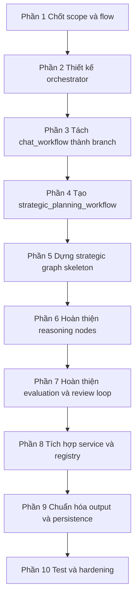

# Military Graph Task Plan

## Cách dùng tài liệu này

Tài liệu này không chia theo phase lớn nữa.
Tài liệu này chia theo **từng phần phải làm**, theo đúng thứ tự nên thực hiện.

Nguyên tắc:

- làm xong `Phần 1` mới sang `Phần 2`
- mỗi phần có output rõ ràng
- nếu một phần chưa xong thì không làm tiếp phần sau

## Tổng quan thứ tự thực hiện

## Phần 1: Chốt scope và flow cuối cùng

### Mục tiêu

Chốt chính xác hệ thống V1 sẽ có những branch nào và không làm gì.

### Cần làm

1. Chốt top-level intents:
   - `normal_chat`
   - `strategic_planning`
   - `unclear`

2. Chốt không còn branch `data_query` trong feature này.

3. Chốt full flow cấp cao:
   - request vào
   - classify
   - route sang `chat_workflow` hoặc `strategic_planning_workflow` hoặc `clarify`
   - trả output cuối

4. Chốt output cuối của strategic planning V1:
   - recommended strategy
   - alternatives
   - attack plan
   - defense plan
   - risk summary
   - resource allocation
   - timeline
   - assumptions
   - open questions

### Xong khi nào

- team không còn tranh luận workflow nào tồn tại
- sơ đồ top-level đã ổn
- user approve scope này

## Phần 2: Thiết kế `conversation_orchestrator_workflow`

### Mục tiêu

Tạo workflow cha để điều phối các branch.

### Cần làm

1. Định nghĩa role của orchestrator:
   - không làm reasoning sâu
   - chỉ chuẩn bị state chung
   - classify intent
   - route đúng branch
   - normalize output cuối

2. Thiết kế state tối thiểu cho orchestrator:
   - `messages`
   - `user_id`
   - `conversation_id`
   - `intent`
   - `agent_response`
   - `tool_calls`
   - `error`

3. Thiết kế các node của orchestrator:
   - `top_level_intent_classifier`
   - `chat_branch_node`
   - `strategic_branch_node`
   - `clarify_branch_node`

4. Viết sơ đồ route:
   - `normal_chat -> chat_branch_node`
   - `strategic_planning -> strategic_branch_node`
   - `unclear -> clarify_branch_node`

### Xong khi nào

- đã có thiết kế rõ orchestrator làm gì và không làm gì
- state và route function đã chốt

## Phần 3: Tách `chat_workflow` hiện tại thành branch workflow

### Mục tiêu

Biến `chat_workflow` từ workflow trung tâm thành workflow con chuyên xử lý chat thường.

### Cần làm

1. Rà lại `chat_workflow` hiện tại đang có gì:
   - `intent_classifier`
   - `chat_node`
   - `data_agent_node`
   - `clarify_node`

2. Chốt phần nào giữ lại:
   - giữ `chat_node`
   - có thể giữ `clarify_node` nếu muốn reuse

3. Chốt phần nào bỏ khỏi branch chat:
   - bỏ `data_agent_node`
   - bỏ intent routing nội bộ kiểu cũ nếu top-level orchestrator đã route từ ngoài

4. Xác định contract mới của `chat_workflow`:
   - input nhận từ orchestrator
   - output trả về `agent_response` thống nhất

### Xong khi nào

- đã rõ `chat_workflow` sau refactor còn lại những node nào
- đã rõ nó là branch con chứ không còn là workflow entrypoint chính

## Phần 4: Tạo `strategic_planning_workflow`

### Mục tiêu

Tạo workflow riêng cho strategic planning.

### Cần làm

1. Chốt workflow này là graph riêng, không nhét vào `chat_workflow`.

2. Tạo danh sách node strategic planning V1:
   - `mission_intake_node`
   - `context_consolidation_node`
   - `information_sufficiency_node`
   - `clarification_questions_node`
   - `analyst_input_merge_node`
   - `problem_framing_node`
   - `planning_mode_router_node`
   - `option_generation_node`
   - `existing_plan_analysis_node`
   - `option_merge_node`
   - `feasibility_review_node`
   - `risk_analysis_node`
   - `adversarial_critique_node`
   - `revise_or_prune_node`
   - `score_and_rank_node`
   - `analyst_review_node`
   - `final_strategy_synthesis_node`
   - `output_formatter_node`

3. Chốt strategic modes:
   - `generate_new_options`
   - `analyze_existing_plan`
   - `hybrid_compare`

### Xong khi nào

- đã có danh sách node đầy đủ
- đã rõ strategic workflow tách biệt với chat workflow

## Phần 5: Dựng strategic graph skeleton

### Mục tiêu

Dựng khung graph và state, chưa cần logic sâu.

### Cần làm

1. Thiết kế state cho `strategic_planning_workflow`:
   - `mission_request`
   - `planning_mode`
   - `mission_context`
   - `known_facts`
   - `missing_information`
   - `assumptions`
   - `planning_objectives`
   - `constraints`
   - `candidate_options`
   - `ranked_options`
   - `analyst_feedback`
   - `selected_direction`
   - `final_strategy`
   - `output_package`
   - `error`

2. Nối các node theo đúng thứ tự graph.

3. Tạo các route chính:
   - clarify loop
   - planning mode route
   - analyst review loop

4. Dùng output schema rõ ràng giữa các node.

### Xong khi nào

- strategic graph compile được
- flow từ node đầu đến node cuối đã nối đủ
- chưa cần logic thực, chỉ cần graph shape đúng

## Phần 6: Hoàn thiện reasoning nodes

### Mục tiêu

Làm cho strategic workflow bắt đầu có giá trị thực tế.

### Cần làm

1. Hoàn thiện `mission_intake_node`
   - đọc request
   - nhận diện loại yêu cầu
   - bóc objective và context ban đầu

2. Hoàn thiện `context_consolidation_node`
   - gom known facts
   - gom unknowns
   - tạo assumptions

3. Hoàn thiện `information_sufficiency_node`
   - quyết định đã đủ thông tin chưa

4. Hoàn thiện `clarification_questions_node`
   - chỉ hỏi những gì thực sự blocking

5. Hoàn thiện `problem_framing_node`
   - biến context thành planning schema

6. Hoàn thiện `option_generation_node`
   - sinh nhiều options đủ khác biệt

7. Hoàn thiện `existing_plan_analysis_node`
   - phân tích plan user cung cấp

8. Hoàn thiện `option_merge_node`
   - hợp nhất generated options và user plan

### Xong khi nào

- strategic workflow tạo được options có cấu trúc
- strategic workflow phân tích được existing plan

## Phần 7: Hoàn thiện evaluation và analyst review loop

### Mục tiêu

Làm phần đánh giá, phản biện, xếp hạng, và loop refinement.

### Cần làm

1. Hoàn thiện `feasibility_review_node`
2. Hoàn thiện `risk_analysis_node`
3. Hoàn thiện `adversarial_critique_node`
4. Hoàn thiện `revise_or_prune_node`
5. Hoàn thiện `score_and_rank_node`
6. Hoàn thiện `analyst_review_node`

7. Chốt các đường loop:
   - analyst yêu cầu thêm dữ liệu -> quay lại clarify
   - analyst sửa assumptions -> quay lại framing
   - analyst cần thêm options -> quay lại generation
   - analyst chốt hướng -> đi tới synthesis

### Xong khi nào

- có ranked options
- có risk và critique rõ ràng
- analyst feedback làm graph chạy lại đúng nhánh

## Phần 8: Tích hợp registry và service

### Mục tiêu

Đưa workflow mới vào entrypoint thật của hệ thống.

### Cần làm

1. Cập nhật `app/graphs/registry.py`
   - đăng ký `conversation_orchestrator_workflow`
   - đăng ký `strategic_planning_workflow`
   - giữ `chat_workflow` như branch hoặc workflow phụ

2. Cập nhật service layer
   - `ChatService` không gọi trực tiếp `chat_workflow` nữa
   - `ChatService` gọi orchestrator workflow

3. Chuẩn hóa input vào workflow cha:
   - messages
   - user_id
   - conversation_id
   - context cần thiết

### Xong khi nào

- request thật đi qua orchestrator thay vì đi thẳng vào chat workflow cũ

## Phần 9: Chuẩn hóa output, streaming, persistence

### Mục tiêu

Làm cho mọi branch trả output thống nhất và hiển thị được ở UI.

### Cần làm

1. Chuẩn hóa contract output cho cả 3 nhánh:
   - chat
   - strategic planning
   - clarify

2. Hoàn thiện `final_strategy_synthesis_node`

3. Hoàn thiện `output_formatter_node`

4. Tích hợp streaming response

5. Tích hợp lưu assistant message cuối

6. Đảm bảo completion event chạy ổn định

### Xong khi nào

- strategic output hiển thị được trong luồng chat thật
- chat và strategic trả format đủ nhất quán để frontend dùng

## Phần 10: Test và hardening

### Mục tiêu

Đảm bảo flow mới ổn trước khi rollout.

### Cần làm

1. Test orchestrator route đúng branch
2. Test strategic clarify loop
3. Test strategic generate path
4. Test strategic analyze path
5. Test strategic hybrid path
6. Test analyst review loop
7. Thêm logging cho:
   - route decisions
   - node transitions
   - loop count
   - node failures
8. Thêm guardrails:
   - max options
   - max refinement loops
   - retry policy nếu cần

### Xong khi nào

- route đúng
- loop không lỗi
- output ổn định
- có log đủ để debug

## Checklist ngắn để làm lần lượt

1. Chốt scope cuối cùng.
2. Chốt thiết kế orchestrator.
3. Chốt chat_workflow sau refactor còn gì.
4. Chốt danh sách node strategic workflow.
5. Dựng state và graph skeleton cho strategic workflow.
6. Làm reasoning nodes.
7. Làm evaluation và review loop.
8. Nối orchestrator với registry và service.
9. Chuẩn hóa output và persistence.
10. Viết test và hardening.

## Gợi ý cách thực hiện thực tế

Nếu làm đúng kiểu từng phần một, mình khuyên thứ tự làm việc là:

- hôm 1: làm `Phần 1` và `Phần 2`
- hôm 2: làm `Phần 3` và `Phần 4`
- hôm 3: làm `Phần 5`
- hôm 4: làm `Phần 6`
- hôm 5: làm `Phần 7`
- hôm 6: làm `Phần 8` và `Phần 9`
- hôm 7: làm `Phần 10`

## Điều quan trọng nhất

Không bắt đầu bằng strategic node logic ngay.
Phải làm đúng thứ tự:

1. chốt orchestrator
2. chốt branch boundaries
3. dựng graph skeleton
4. rồi mới đổ reasoning vào từng node

Nếu làm ngược lại, rất dễ rơi vào tình trạng strategic logic viết xong nhưng không biết gắn vào flow nào.
