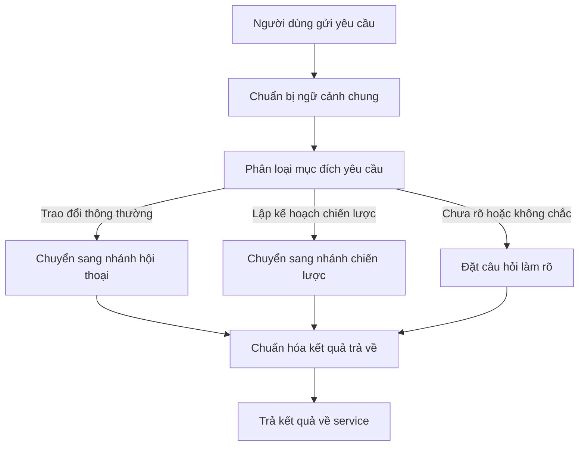

## Context

The current conversation entry flow is centered around `chat_workflow`, which combines top-level intent routing with branch-specific execution. That structure is sufficient for a small chat-first system, but it becomes a poor fit for the military strategic planning feature because the entrypoint must now decide between general conversation, strategic planning, and clarification while remaining simple and auditable.

The planned product shape already points to a parent-child workflow architecture:

- a top-level conversation orchestrator
- a normal chat branch
- a strategic planning branch
- a clarification fallback path

For V1, the new parent workflow should remain intentionally thin. It should not perform deep reasoning, planning, or domain-specific analysis. Those concerns belong in downstream branches. The parent workflow should only own shared state preparation, top-level intent classification, branch routing, and normalized output shaping.

Current constraints:

- `clarify` remains a node in the parent graph, not a separate workflow
- service layer continues to own persistence, streaming, and completion events
- top-level routing must use exactly three intents:
  - `chat`
  - `strategic_planning`
  - `unclear`
- when classification is uncertain, the system must route to `unclear`
- design priority is simplicity first, with balanced cost

Stakeholders:

- platform/backend team implementing LangGraph workflows
- product/design owner defining the conversation flow for strategic support
- downstream service layer consuming a stable orchestrator output contract

## Goals / Non-Goals

**Goals:**

- Introduce a dedicated `conversation_orchestrator_workflow` as the top-level workflow entrypoint.
- Keep the orchestrator deterministic, thin, and easy to reason about.
- Standardize top-level routing around `chat`, `strategic_planning`, and `unclear`.
- Define a stable output envelope that every route returns to the service layer.
- Preserve a clean separation between parent orchestration and child workflow logic.
- Make the top-level flow observable and easy to debug.

**Non-Goals:**

- Designing the internal logic of `strategic_planning_workflow`
- Refactoring the full implementation of `chat_workflow`
- Moving persistence, streaming, or completion dispatch into the graph layer
- Introducing new external dependencies or a supervisor-style multi-agent controller
- Solving all downstream UI rendering concerns in this change

## Decisions

### 1. Use a thin parent router graph instead of a supervisor agent

The orchestrator will be implemented as a deterministic `StateGraph` with explicit conditional routing. It will not use a reasoning-heavy supervisor pattern.

Rationale:

- the system only needs to select between three top-level paths
- deterministic routing is easier to test and audit
- cost and latency remain lower than a planner-style supervisor
- it prevents business reasoning from leaking into the entrypoint layer

Alternatives considered:

- supervisor agent with tool/subgraph delegation: rejected because it adds unnecessary complexity for only three top-level intents
- keeping `chat_workflow` as the long-term entrypoint: rejected because it couples top-level routing to one branch implementation

### 2. Keep parent state minimal and branch-agnostic

The orchestrator state should only contain fields shared across top-level routes.

Recommended parent state:

- `messages`
- `user_id`
- `conversation_id`
- `intent`
- `response_type`
- `agent_response`
- `final_payload`
- `tool_calls`
- `error`

Rationale:

- avoids coupling the parent workflow to branch-specific state
- keeps the parent contract stable while child workflows evolve
- makes future branch replacement or refactor easier

Alternatives considered:

- exposing child workflow state directly in the parent: rejected because it creates tight coupling and makes the parent schema unstable
- using only `agent_response` without structured payload: rejected because strategic responses need a structured envelope later

### 3. Standardize classification on three top-level intents with conservative fallback

The classifier will output exactly one of:

- `chat`
- `strategic_planning`
- `unclear`

If classification is ambiguous or fails, the orchestrator must route to `unclear`.

Rationale:

- prevents wrong routing into a high-cost or semantically wrong branch
- keeps clarification behavior explicit
- aligns with the product requirement that uncertainty should not be hidden

Alternatives considered:

- forcing the classifier to choose between `chat` and `strategic_planning`: rejected because it increases misrouting risk
- keeping the existing `data_query` top-level route: rejected because it is out of scope for this feature direction

### 4. Use branch wrapper nodes, not direct shared-state execution

The parent graph should invoke each branch through wrapper nodes that map parent input to branch input and map branch output back into the normalized parent envelope.

High-level flow:



Rationale:

- parent and child schemas can evolve independently
- each branch can keep its own internal state design
- normalization happens at a single boundary

Alternatives considered:

- sharing one large schema across parent and child workflows: rejected because it increases coupling and makes future maintenance harder

### 5. Normalize every route into a stable output envelope

The orchestrator returns one shared contract regardless of which branch was selected.

Recommended envelope:

```python
{
    "intent": "chat | strategic_planning | unclear",
    "response_type": "chat_message | clarification_request | strategic_package",
    "agent_response": "text response for the service layer and UI chat stream",
    "final_payload": {},
    "tool_calls": [],
    "error": None,
}
```

Field meanings:

- `intent`: top-level routing decision
- `response_type`: tells the consumer what kind of result was produced
- `agent_response`: user-readable text summary or direct response
- `final_payload`: structured data for richer consumers or branch-specific rendering
- `tool_calls`: optional tool activity summary for compatible branches
- `error`: normalized failure information

Rationale:

- preserves compatibility with the current service contract centered around `agent_response`
- creates room for strategic branch structured output without redesigning the parent API later
- keeps branch-specific internal state out of the service boundary

Alternatives considered:

- returning only `agent_response`: rejected because it collapses strategic output into plain text
- returning raw child output: rejected because downstream behavior would depend on branch internals

### 6. Keep service-layer responsibilities unchanged

The orchestrator will not own:

- loading or persisting messages
- streaming token events
- dispatching completion events

Rationale:

- preserves the current architectural boundary
- avoids mixing transport concerns with graph orchestration concerns
- reduces migration risk for the first version

Alternatives considered:

- moving lifecycle concerns into the graph: rejected because it would broaden the change scope unnecessarily

### 7. Add lightweight observability at the orchestration boundary

The orchestrator should emit or record enough metadata for debugging and auditability, even if the service layer remains the final owner of persistence.

Recommended observability data:

- `conversation_id`
- selected `intent`
- selected route source
- normalized `response_type`
- execution outcome
- error class or failure reason when present

Rationale:

- the parent workflow is the cleanest place to inspect routing decisions
- misrouting or repeated clarification loops can be diagnosed more easily

Alternatives considered:

- no parent-level route metadata: rejected because it makes debugging route behavior harder

## Risks / Trade-offs

- [Classifier routes too aggressively] -> Mitigation: require conservative routing and fall back to `unclear` on ambiguity or failure.
- [Parent becomes coupled to child workflows] -> Mitigation: use wrapper nodes and keep the parent schema branch-agnostic.
- [Output contract becomes too thin for strategic use cases] -> Mitigation: keep `final_payload` in the envelope from V1 even if some branches use it lightly at first.
- [Output contract becomes too heavy for a simple router] -> Mitigation: keep the envelope small and avoid embedding child internal state.
- [The orchestrator starts absorbing service responsibilities over time] -> Mitigation: explicitly document persistence, streaming, and completion as non-goals of this workflow.
- [Route debugging is difficult after rollout] -> Mitigation: add lightweight routing metadata and logs at the parent boundary.

## Migration Plan

1. Add the new `conversation_orchestrator_workflow` as a separate workflow in `app/graphs/workflows/`.
2. Define its parent state and normalized output envelope.
3. Implement a top-level classifier that emits only `chat`, `strategic_planning`, or `unclear`.
4. Add wrapper nodes for:
   - chat branch invocation
   - strategic branch invocation
   - clarification response
5. Register the orchestrator as the application-level workflow entrypoint.
6. Update the service layer to invoke the orchestrator instead of calling `chat_workflow` directly.
7. Validate route behavior for:
   - normal chat requests
   - strategic planning requests
   - ambiguous requests

Rollback strategy:

- revert the service entrypoint to the existing `chat_workflow`
- keep child branch workflows untouched so rollback only affects the top-level entrypoint

## Open Questions

- Should `response_type` stay minimal in V1 or be formalized as an enum shared across service and UI layers?
- Should the orchestrator record a lightweight route rationale for debugging, or is the chosen `intent` enough for V1?
- Should `tool_calls` remain in the parent envelope for all routes, or only for branches that actually use tool execution?
- How much recent conversation context should the top-level classifier inspect before routing decisions become too expensive?
