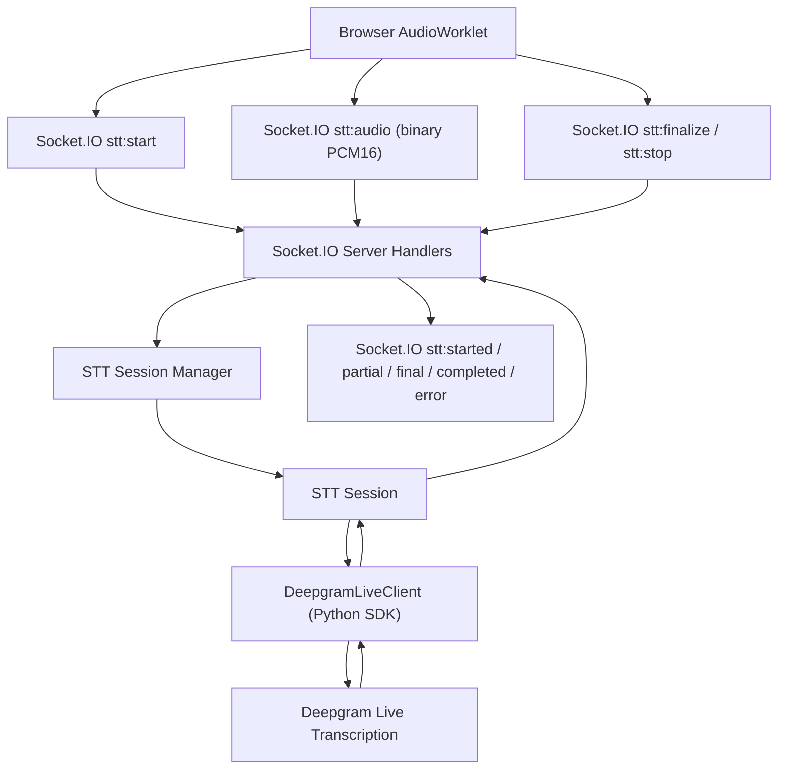

## Context

The platform already has an authenticated Socket.IO channel, user-scoped socket routing, and service/repository/infrastructure layering. What is missing is a realtime speech-to-text path that can accept browser microphone audio, stream it to a provider from the backend, and return partial and final transcript updates to the frontend without exposing provider credentials.

This change introduces live speech transcription for browser users by reusing the existing Socket.IO connection and forwarding raw audio to Deepgram live transcription. The accepted phase 1 audio contract is fixed:

- browser only
- `AudioWorklet` capture on the frontend
- `PCM16`, `mono`, `16kHz`
- frontend frames in the `20-40ms` range
- `1 active stream per socket`
- partial and final transcript updates streamed to UI only

The user explicitly requested that backend interaction with Deepgram use the official Python SDK instead of a hand-rolled raw websocket client. The design therefore separates:

- **provider transport concerns** inside a dedicated `DeepgramLiveClient`
- **session ownership, stream state, transcript assembly, and socket emission** inside our own STT service/session layer

This separation matters because Deepgram's SDK surface evolves over time, while our application-level stream contract should remain stable.

**Relevant official Deepgram sources used for this design:**
- [Deepgram Python SDK README](https://github.com/deepgram/deepgram-python-sdk)
- [Deepgram Python SDK websocket client reference](https://deepgram.github.io/deepgram-python-sdk/docs/v3/deepgram/clients/listen/client.html)
- [Deepgram Python SDK async websocket client reference](https://deepgram.github.io/deepgram-python-sdk/docs/v3/deepgram/clients/listen/v1/websocket/async_client.html)
- [Deepgram Python SDK live transcription events enum](https://deepgram.github.io/deepgram-python-sdk/docs/v3/deepgram/clients/listen/enums.html)
- [Deepgram Python SDK abstract async websocket send semantics](https://deepgram.github.io/deepgram-python-sdk/docs/v3/deepgram/clients/common/v1/abstract_async_websocket.html)
- [SDK features overview](https://developers.deepgram.com/sdks/sdk-features)
- [Live streaming transcription API reference](https://developers.deepgram.com/reference/speech-to-text-api/listen-streaming)
- [Encoding](https://developers.deepgram.com/docs/encoding)
- [Sample rate](https://developers.deepgram.com/docs/sample-rate)
- [Endpointing and interim results](https://developers.deepgram.com/docs/understand-endpointing-interim-results)
- [Endpointing](https://developers.deepgram.com/docs/endpointing)
- [Utterance End](https://developers.deepgram.com/docs/utterance-end)
- [Audio Keep Alive](https://developers.deepgram.com/docs/audio-keep-alive)
- [Finalize](https://developers.deepgram.com/docs/finalize)
- [Recovering from connection errors and timeouts](https://developers.deepgram.com/docs/recovering-from-connection-errors-and-timeouts-when-live-streaming-audio)

**Constraints:**
- Backend must use the existing authenticated Socket.IO transport already mounted in the app
- Phase 1 does not persist transcripts
- Phase 1 does not trigger downstream agent/workflow execution
- Phase 1 does not support more than one active STT stream on the same socket
- The client may pass `language`; backend defaults to `en` when omitted
- Horizontal scaling beyond one app instance will require stream affinity because each live stream is stateful

## Goals / Non-Goals

**Goals:**
- Reuse the existing Socket.IO connection for live STT
- Accept raw browser audio in the agreed `PCM16 mono 16kHz` format
- Use Deepgram's official Python SDK for live transcription transport
- Emit stable `partial` and `final` transcript events back to the same user connection
- Keep provider API keys on the backend only
- Enforce `1 active stream per socket`
- Keep the architecture extensible for future downstream workflow consumption

**Non-Goals:**
- Transcript persistence
- Speaker diarization or multi-speaker interpretation within one stream
- Direct browser-to-Deepgram connections
- Multiple concurrent active STT streams on one socket
- Native websocket transport separate from the current Socket.IO layer
- Provider failover across multiple STT vendors
- Automatic reconnect with transcript continuity after backend or client disconnect

## High-Level Architecture



The application owns all stream lifecycle and routing. Deepgram is used only as the provider transport and transcript source.

## Decisions

### D1: Reuse the existing Socket.IO transport for browser audio and transcript delivery

**Decision**: Use the existing authenticated Socket.IO connection for both control events and binary audio chunks.

**Alternatives considered**:
- **Native WebSocket just for STT**: lower protocol overhead, but introduces a second realtime transport, another auth path, and more frontend/backend operational complexity
- **REST upload of audio chunks**: too chatty and high-latency for live transcription

**Rationale**: The current codebase already authenticates Socket.IO connections, stores socket session context, and emits user-scoped realtime events. Reusing it reduces integration risk and avoids splitting realtime infrastructure. The small extra protocol overhead is acceptable for phase 1 because the transcript provider roundtrip dominates latency more than Socket.IO framing.

### D2: Use Deepgram's official Python SDK behind an infrastructure adapter

**Decision**: All backend communication with Deepgram SHALL go through a dedicated `DeepgramLiveClient` wrapper that uses the official Python SDK.

**Alternatives considered**:
- **Raw websocket client**: gives full control, but duplicates provider protocol concerns and diverges from the user's requirement to use the Python SDK
- **Call Deepgram directly from frontend**: exposes provider credentials and bypasses backend policy enforcement

**Rationale**: The Python SDK is the official integration path and encapsulates provider handshake and event handling. However, the application should not let SDK naming or callback details leak into business logic. The wrapper keeps the rest of the system stable if Deepgram changes SDK method names or websocket client organization in future SDK versions. This is an intentional encapsulation boundary, not an abstraction for abstraction's sake.

**Current researched SDK surface to target:**
- instantiate `AsyncDeepgramClient(api_key=...)`
- open a live websocket with `client.listen.v1.connect()`
- register callbacks with `.on(EventType..., handler)`
- start the session with `.start(options)`
- push PCM bytes with `.send(bytes)`
- keep idle sessions alive with `.keep_alive()`
- flush remaining transcript with `.finalize()`
- close cleanly with `.finish()`

This design intentionally chooses `listen.v1.connect()` instead of `listen.v2.connect()` because phase 1 uses `nova-3` on the standard live transcription path, not Flux turn-taking.

### D3: Treat each live transcription as a stateful per-socket session

**Decision**: Introduce an application-owned `STTSession` per active stream and an `STTSessionManager` keyed by socket ID.

**Rationale**: Live transcription is inherently stateful. We must track:
- owning `sid`
- owning `user_id`
- `stream_id`
- current provider connection
- transcript buffers for final segment assembly
- last audio timestamp / inactivity timeout
- session state (`starting`, `streaming`, `finalizing`, `completed`, `failed`)

Deepgram SDK callbacks alone are not enough because the application still needs to bind transcript output back to the correct user socket and enforce our own single-stream rule.

### D4: Use raw PCM16 mono 16kHz end-to-end for phase 1

**Decision**: The frontend and backend contract is fixed to raw `PCM16`, `mono`, `16kHz`.

**Alternatives considered**:
- **MediaRecorder with WebM/Opus**: easier capture path, but timing is less predictable and container/codec handling is less explicit
- **Browser-native sample rate passthrough**: would require resampling logic deeper in backend/provider handling and produce more validation branches

**Rationale**: Deepgram's live transcription docs explicitly support raw PCM when `encoding` and `sample_rate` are provided. A fixed audio contract reduces ambiguity in both the browser processor and backend validation path. It also makes future latency and buffering behavior easier to reason about.

### D5: Use Nova-3 for phase 1 live STT with interim and endpointing features enabled

**Decision**: Configure Deepgram live transcription around `Nova-3` for phase 1 with:
- `interim_results=true`
- `vad_events=true`
- `endpointing=400`
- `utterance_end_ms=1000`
- `encoding=linear16`
- `sample_rate=16000`
- `channels=1`
- `language=<client value or en>`

**Alternatives considered**:
- **Flux**: more voice-agent-oriented turn detection capabilities, but unnecessary complexity for a phase focused only on UI transcript streaming
- **No interim results**: simpler output, but fails the requirement for live partial transcripts

**Rationale**: The Deepgram docs position interim results, endpointing, and utterance end as the primary controls for realtime transcript behavior. `Nova-3` is the appropriate baseline model for live STT without prematurely optimizing for conversational turn-taking semantics.

**Proposed SDK start options:**

```python
{
    "model": "nova-3",
    "encoding": "linear16",
    "sample_rate": 16000,
    "channels": 1,
    "language": language or "en",
    "interim_results": True,
    "vad_events": True,
    "endpointing": 400,
    "utterance_end_ms": "1000",
}
```

### D6: Interpret Deepgram output in our own transcript state machine

**Decision**: The backend will not forward provider events blindly. Instead, it normalizes Deepgram transcript events into the application contract:

- `stt:partial` for non-final transcript updates
- `stt:final` when a speech-final boundary is reached
- `stt:completed` when the stream is cleanly finalized and flushed
- `stt:error` when the session cannot proceed

**Rationale**: Deepgram returns provider-specific event types and transcript metadata. The frontend should not be coupled to those provider details. This design also leaves space for a future vendor swap or a multi-provider strategy without changing the frontend contract.

### D7: Final transcript emission follows speech-final boundaries, not every final fragment

**Decision**: The backend SHALL buffer provider-final fragments as needed and emit `stt:final` only when the provider indicates an utterance/speech-final boundary suitable for UI commit.

**Rationale**: Deepgram's docs distinguish between interim output, final segments, endpointing, and utterance end behavior. If we emit every provider-final fragment directly, the frontend risks over-committing text too early. The backend needs a small assembly layer so UI semantics stay stable.

**Proposed interpretation rule:**
- `is_final=false` -> emit `stt:partial`
- `is_final=true` but not end-of-speech -> hold or merge inside current session buffer
- `speech_final=true` -> emit `stt:final`
- `UtteranceEnd` may be used as a flush aid if the provider indicates no more words are coming, but it is not the primary commit trigger

### D8: Finalize and stop are separate commands

**Decision**: Keep two explicit client controls:
- `stt:finalize` means flush the active stream and wait for remaining transcript output
- `stt:stop` means stop the session and clean up resources

**Rationale**: Deepgram documents separate finalize and close behaviors. Treating them as separate commands lets the app flush a clean final transcript before tearing down session state. This is safer than treating disconnect/stop as an implicit flush.

### D9: Use explicit keepalive and inactivity management

**Decision**: The backend session owns keepalive and inactivity timing rather than leaving idle behavior implicit.

**Rationale**: Deepgram provides explicit keepalive guidance for live streams. The session layer should send keepalive messages when the stream is open but temporarily idle, and it should also enforce local inactivity cleanup so zombie streams do not survive forever after frontend failure.

**Proposed phase 1 behavior:**
- send provider keepalive periodically while a stream remains open but silent
- if no audio and no explicit finalize/stop occurs for a bounded timeout window, close the session locally

### D10: Horizontal scaling requires socket affinity

**Decision**: Phase 1 keeps STT session state in-process on the instance that owns the socket connection.

**Rationale**: Redis-backed Socket.IO fanout already exists for outbound events, but it does not solve inbound audio routing. A live provider connection and active transcript buffer live in memory on one process. If multiple app instances are deployed, the load balancer must keep a socket bound to the instance that created the session, or a more complex distributed STT session layer will be needed later.

## Deepgram SDK Integration Approach

The backend will use the async SDK path and isolate it inside `app/infrastructure/deepgram/client.py`.

**Proposed integration shape:**

```python
from deepgram import AsyncDeepgramClient
from deepgram.core.events import EventType


class DeepgramLiveClient:
    async def open(self, *, language: str) -> None:
        self._client = AsyncDeepgramClient(api_key=self._api_key)
        self._conn = self._client.listen.v1.connect()

        self._conn.on(EventType.OPEN, self._on_open)
        self._conn.on(EventType.MESSAGE, self._on_message)
        self._conn.on(EventType.CLOSE, self._on_close)
        self._conn.on(EventType.ERROR, self._on_error)

        await self._conn.start(
            {
                "model": "nova-3",
                "encoding": "linear16",
                "sample_rate": 16000,
                "channels": 1,
                "language": language or "en",
                "interim_results": True,
                "vad_events": True,
                "endpointing": 400,
                "utterance_end_ms": "1000",
            }
        )

    async def send_audio(self, chunk: bytes) -> bool:
        return await self._conn.send(chunk)

    async def keepalive(self) -> bool:
        return await self._conn.keep_alive()

    async def finalize(self) -> bool:
        return await self._conn.finalize()

    async def close(self) -> bool:
        return await self._conn.finish()
```

**Why this exact shape:**
- `AsyncDeepgramClient` is the official async client entrypoint in the SDK README
- the live websocket client supports `start`, `on`, `keep_alive`, `finalize`, and `finish`
- the shared async websocket base client supports `send(data: Union[str, bytes])`, which is how raw PCM bytes are written to the Deepgram stream

The application still hides these SDK details behind our wrapper so the service and socket layers only depend on an internal contract.

## File Structure

```
app/
├── infrastructure/deepgram/
│   ├── __init__.py
│   └── client.py                 # DeepgramLiveClient using official Python SDK
│
├── services/stt/
│   ├── __init__.py
│   ├── session.py                # STTSession state machine + transcript assembly
│   └── session_manager.py        # one active session per socket
│
├── domain/schemas/
│   └── stt.py                    # socket payload models and normalized transcript payloads
│
├── socket_gateway/
│   └── server.py                 # register stt:start/audio/finalize/stop handlers
│
├── common/
│   ├── event_socket.py           # ADD: STTEvents
│   ├── exceptions.py             # ADD: STT/session/provider exceptions
│   └── service.py                # ADD: get_deepgram_live_client, get_stt_session_manager
│
└── config/
    └── settings.py               # ADD: DEEPGRAM_* settings
```

## Provider Event Mapping

At the adapter boundary, provider events are normalized into a smaller internal event model:

- `provider_open`
- `provider_transcript_partial`
- `provider_transcript_final_fragment`
- `provider_speech_started`
- `provider_utterance_end`
- `provider_speech_final`
- `provider_error`
- `provider_close`

The socket layer never sees raw provider event names. It only sees normalized STT lifecycle output produced by `STTSession`.

**Deepgram event mapping source:**
- SDK enum exposes websocket events including `Open`, `Close`, `Transcript`, `Metadata`, `UtteranceEnd`, `SpeechStarted`, `Finalize`, `Error`, `Unhandled`, and `Warning`
- live transcript payloads include fields such as `is_final`, `speech_final`, and `from_finalize`
- `UtteranceEnd` payloads include `last_word_end`, which can be used as a secondary flush aid

## Socket Contract

**Inbound**
- `stt:start`
- `stt:audio`
- `stt:finalize`
- `stt:stop`

**Outbound**
- `stt:started`
- `stt:partial`
- `stt:final`
- `stt:completed`
- `stt:error`

**Payload rules**
- every outbound payload includes `stream_id`
- every outbound payload includes additive `organization_id` when present in socket context
- `stt:audio` uses binary payload plus lightweight metadata, not base64
- the backend rejects audio when no active session exists for that socket

## Risks / Trade-offs

**[Socket.IO binary framing adds overhead compared with native websocket]**
Acceptable for phase 1 because reuse of existing auth/session infrastructure materially reduces complexity and delivery risk.

**[Deepgram SDK surface may change between versions]**
Mitigation: isolate all SDK usage to `DeepgramLiveClient` and pin/test the dependency version explicitly. The official SDK repository already documents migration between major SDK generations, so we should treat SDK churn as expected rather than exceptional.

**[Interim/final transcript behavior can feel inconsistent if frontend is tightly coupled to provider semantics]**
Mitigation: keep transcript commit logic in `STTSession` and emit only normalized application events.

**[A live stream is lost if the socket disconnects]**
Acceptable for phase 1. Reconnect-and-resume with transcript continuity is out of scope.

**[Replaying buffered audio too aggressively after transient provider failure can increase lag or violate provider guidance]**
Mitigation: phase 1 will not attempt automatic resume with deep backlog replay. If reconnect is introduced later, cap replay backlog and replay rate in line with Deepgram's recovery guidance.

**[Multiple app instances require affinity]**
Mitigation: document sticky-session requirement for any horizontally scaled deployment until a distributed session layer exists.

## Migration Plan

1. Add `deepgram-sdk` dependency and environment variables
2. Add STT event constants and schema payloads
3. Implement the Deepgram SDK wrapper in infrastructure
4. Implement `STTSession` and `STTSessionManager`
5. Register Socket.IO handlers for STT events
6. Verify manual happy path with browser AudioWorklet input

## Open Questions

- Should phase 1 reject unsupported `language` values at stream start or let Deepgram validate them and return provider errors?
- Should inactivity timeout auto-finalize before close, or hard-close immediately when the stream goes idle too long?
- Do we want to expose provider confidence scores in `stt:final` now, or keep the frontend payload minimal until the UI needs them?
