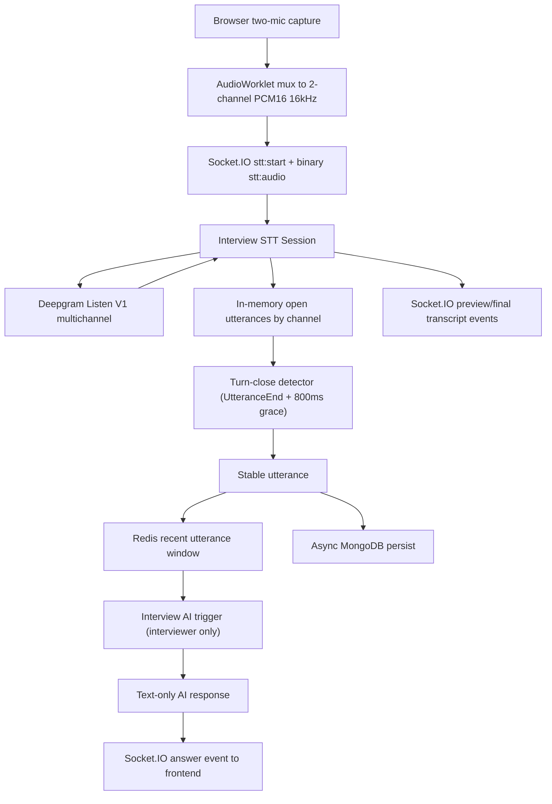

## Context

The platform already has an authenticated Socket.IO channel, user-scoped socket
routing, a Redis-backed realtime stack, and an existing Deepgram-backed live
speech transcription path. However, the current speech-to-text capability is
single-channel, transcript-oriented, and focused on UI updates rather than
speaker-aware interview assistance.

This change introduces a different interaction model:

- the browser captures two microphones in the same interview session
- audio is multiplexed into one multichannel stream
- channel identity is mapped explicitly to `interviewer` and `user`
- partial transcript updates remain available for UI preview
- neither Redis nor MongoDB stores unstable partials
- only stable, closed utterances are persisted
- AI is triggered only after an interviewer turn is closed and already written
  to Redis

This design must align with the latest official Deepgram behavior for live
streaming, multichannel transcription, endpointing, utterance-end signaling,
finalization, and keepalive handling.

**Relevant official Deepgram sources used for this design:**
- [Multichannel](https://developers.deepgram.com/docs/multichannel)
- [When To Use Multichannel and Diarization](https://developers.deepgram.com/docs/multichannel-vs-diarization)
- [Live Audio WebSocket reference](https://developers.deepgram.com/reference/speech-to-text-api/listen-streaming)
- [Utterance End](https://developers.deepgram.com/docs/utterance-end)
- [End of Speech Detection While Live Streaming](https://developers.deepgram.com/docs/understanding-end-of-speech-detection)
- [Configure Endpointing and Interim Results](https://developers.deepgram.com/docs/understand-endpointing-interim-results)
- [Endpointing](https://developers.deepgram.com/docs/endpointing)
- [Speech Started](https://developers.deepgram.com/docs/speech-started)
- [Audio Keep Alive](https://developers.deepgram.com/docs/audio-keep-alive)
- [Finalize](https://developers.deepgram.com/docs/finalize)
- [Close Stream](https://developers.deepgram.com/docs/close-stream)
- [Deepgram Python SDK websockets reference](https://github.com/deepgram/deepgram-python-sdk/blob/main/websockets-reference.md)
- [Deepgram Python SDK migration notes](https://github.com/deepgram/deepgram-python-sdk/blob/main/docs/Migrating-v3-to-v5.md)

**Key Deepgram findings that drive this design:**
- `multichannel=true` makes Deepgram transcribe each audio channel
  independently and return `channel_index` so the application can attribute
  transcript messages to the correct channel
- `speech_final=true` marks an end-of-speech style boundary for a transcript
  segment, but that is not equivalent to "the speaker has fully completed their
  thought"
- `utterance_end_ms` detects a gap after the last finalized word, requires
  `interim_results=true`, and on hosted Deepgram offers no practical benefit
  below `1000ms`
- Deepgram explicitly notes that `UtteranceEnd` can still fire even if the
  speaker continues after a gap, which makes additional application-side turn
  logic necessary for voice-agent-like behavior
- Listen V1 keepalive is manual in modern SDK versions and should be sent every
  `3-5s` during silence to avoid the `NET-0001` inactivity timeout
- `Finalize` flushes pending audio and can optionally target a specific
  channel; `CloseStream` closes the websocket stream

**Constraints:**
- Backend must continue to use the existing authenticated Socket.IO transport
- Frontend must send raw multichannel browser audio as `PCM16`, `16kHz`
- Speaker role identity must be deterministic and not inferred heuristically
- UI preview is required, but preview data must not be persisted
- Redis is for low-latency stable context reads only
- MongoDB is for durable storage only and is not on the AI trigger critical path
- AI output is text-only in this phase
- Sticky sessions are still required because the active live session remains
  process-local

## Goals / Non-Goals

**Goals:**
- Support two-microphone interview audio using one multichannel Deepgram stream
- Preserve explicit channel-to-role mapping for `interviewer` and `user`
- Continue emitting preview transcript updates to the UI
- Persist only stable, closed utterances
- Trigger AI only after an interviewer turn is closed
- Build AI context from a recent interviewer+user utterance window stored in
  Redis
- Persist stable utterances asynchronously to MongoDB without delaying AI
  response generation
- Keep the Deepgram integration isolated behind an internal adapter

**Non-Goals:**
- Persisting partial transcript updates
- Using diarization as the primary speaker attribution mechanism
- Direct browser-to-Deepgram connections
- Voice output or TTS playback
- Triggering AI on user utterance closure
- Long-history prompt replay on every AI call
- Distributed shared live-session ownership across app instances
- Automatic transcript continuity after socket/provider reconnect

## High-Level Architecture



The system uses one authenticated browser socket and one Deepgram live
connection per interview conversation. All unstable transcript state stays in
process memory. Redis stores only stable conversation context. MongoDB trails
behind asynchronously as the durable record.

## Decisions

### D1: Use Deepgram multichannel rather than separate mono streams

**Decision**: Represent the interview audio as one multichannel Deepgram stream
with `channels=2` and `multichannel=true`, rather than two independent provider
streams or diarization-driven speaker attribution.

**Alternatives considered:**
- **Two independent provider streams with a `source` field on each chunk**:
  workable, but harder to synchronize and easier to desynchronize when one
  stream stalls or reconnects
- **Single mono stream with diarization**: rejected because we already have
  physically separate microphones and need deterministic speaker identity

**Rationale**: Deepgram's multichannel documentation is a direct fit for audio
where each participant is intentionally isolated on its own channel. The live
API returns `channel_index`, which lets the application attribute transcript
messages deterministically. Diarization is the wrong primary tool here because
it solves "who spoke?" on mixed audio, while this system already controls
speaker separation at capture time.

**Channel mapping rule:**
- channel `0` -> `interviewer`
- channel `1` -> `user`

The mapping is supplied at stream start and stored in the interview session so
the application never has to infer role identity from transcript content.

### D2: Keep one live Deepgram session per conversation and one Socket.IO session per user connection

**Decision**: A single conversation owns a single Deepgram Listen V1 websocket
and a single application session object that manages both channels together.

**Alternatives considered:**
- **One provider session per speaker**: duplicates connection management and
  complicates timing correlation
- **One provider session per utterance**: too expensive and too latency-heavy

**Rationale**: The interview is one live temporal stream with two channels.
Keeping both speakers inside one provider session preserves a shared time base,
allows the system to compare cross-speaker timing if needed later, and reduces
provider/session overhead.

### D3: Stay on Listen V1 + Nova instead of switching the whole design to Flux

**Decision**: Keep the provider transport on Deepgram Listen V1 with a Nova
streaming model, and implement application-level turn closure in our own state
machine.

**Alternatives considered:**
- **Flux turn-based streaming**: attractive for voice-agent cases, but this
  design still needs explicit channel-role mapping, preview transcript updates,
  stable utterance persistence rules, and interviewer-only AI triggering
- **Provider-driven turn closure only**: rejected because our business trigger
  semantics depend on speaker role and persistence timing, not only raw provider
  turn output

**Rationale**: The latest docs confirm that Listen V1 supports multichannel,
`UtteranceEnd`, `SpeechStarted`, `KeepAlive`, `Finalize`, and `CloseStream`. We
already need an application-owned turn detector because Deepgram explicitly
notes that `UtteranceEnd` alone is not ideal when you need to wait for truly
complete thoughts. Since that logic must exist anyway, Nova + Listen V1 is the
more stable fit for this phase.

**Proposed provider options:**

```python
{
    "model": "nova-3",
    "encoding": "linear16",
    "sample_rate": "16000",
    "channels": "2",
    "multichannel": "true",
    "interim_results": "true",
    "vad_events": "true",
    "endpointing": "300",
    "utterance_end_ms": "1000",
}
```

**Why these values:**
- `channels=2` and `multichannel=true` are required for channel-separated
  transcripts
- `interim_results=true` is required for `UtteranceEnd`
- `endpointing=300` encourages prompt segment stabilization via
  `speech_final=true`
- `utterance_end_ms=1000` follows hosted Deepgram guidance that lower values do
  not provide meaningful benefit

### D4: Keep UI preview, but treat preview as volatile process-local state

**Decision**: Continue emitting preview transcript updates to the frontend, but
do not persist preview or partial transcript state to Redis or MongoDB.

**Alternatives considered:**
- **Persist preview into Redis**: rejected because it pollutes context with
  unstable text and increases churn
- **Disable preview entirely**: rejected because UI responsiveness remains a
  requirement

**Rationale**: Preview exists for user experience, not as a durable business
 record. The application can emit `stt:partial`/preview events from in-memory
 state while keeping Redis strictly reserved for stable context.

**Persistence rule:**
- `is_final=false` -> preview/UI only
- `is_final=true` or `speech_final=true` -> merge into the open utterance in
  memory
- only a fully closed utterance is written to Redis and MongoDB

### D5: Define application-owned `turn_closed` separately from provider events

**Decision**: Introduce an internal `turn_closed` transition that is not
  identical to `speech_final` and not identical to `UtteranceEnd`.

**Rationale**: Deepgram's docs separate:
- `speech_final`: endpoint-style finalized transcript segment
- `UtteranceEnd`: silence-gap detection after the last finalized word

Neither signal alone matches the business rule "interviewer has finished enough
of a turn that AI should respond now". Therefore, the application defines:

1. **segment stable** when Deepgram returns `is_final=true` or `speech_final=true`
2. **utterance close candidate** when Deepgram emits `UtteranceEnd` for the channel
3. **turn closed** when `UtteranceEnd` is followed by `800ms` of additional
   silence on that same channel with no new `SpeechStarted`, preview, or final
   transcript event for that channel

**Turn-close algorithm:**

```text
on transcript(channel):
  update open utterance in memory
  cancel any pending close timer for that channel

on utterance_end(channel):
  start 800ms close timer for that channel

on speech_started(channel) or new transcript(channel) before timer fires:
  cancel close timer

on close timer fire:
  close the open utterance for that channel
  write stable utterance to Redis
  enqueue async MongoDB persistence
  if source == interviewer:
    trigger AI
```

This makes `UtteranceEnd` an input signal to the turn detector rather than the
trigger itself.

### D6: Keep unstable/open utterances in memory, not Redis

**Decision**: Open utterances and turn-close timers live only inside the active
interview session in process memory.

**Alternatives considered:**
- **Redis for open utterances and timers**: rejected because the user explicitly
  wants Redis to store only stable state
- **MongoDB for open utterances**: rejected because it adds unnecessary write
  latency and churn to the realtime path

**Rationale**: The active session already owns the Deepgram websocket and
Socket.IO connection. It is the correct location for unstable state such as
preview text, in-flight final segments, and pending turn timers.

**In-memory session state:**
- `conversation_id`
- `channel_map`
- `open_utterances[channel]`
- `turn_close_tasks[channel]`
- `last_provider_activity_at`
- `last_audio_at`
- `deepgram_request_id`

### D7: Redis stores only stable recent utterances used for AI context

**Decision**: Redis is a low-latency read model that stores only stable,
closed utterances.

**Recommended Redis structures:**
- `conv:{id}:recent_utterances`
  - ordered list or sorted set of recently closed utterances
- `conv:{id}:metadata`
  - stable conversation metadata such as channel-role mapping

**Stored utterance shape:**

```json
{
  "utterance_id": "string",
  "conversation_id": "string",
  "source": "interviewer|user",
  "channel": 0,
  "text": "string",
  "started_at": "datetime",
  "ended_at": "datetime",
  "turn_closed_at": "datetime"
}
```

**Rationale**: AI generation needs a fast, stable context window. Redis should
store only data that is safe to read as truth for the current live flow.
Preview/partial text fails that requirement and is therefore excluded.

### D8: MongoDB persistence is asynchronous and archival, not part of the trigger critical path

**Decision**: After a stable utterance is written to Redis, MongoDB persistence
is executed asynchronously.

**Alternatives considered:**
- **Write MongoDB before Redis**: safer for durability, but slows the path that
  gates AI triggering
- **Write only Redis**: rejected because durable historical storage is required

**Rationale**: The user explicitly wants Redis-first for speed and MongoDB for
durable storage. The consequence is that the system prefers low-latency
interview responsiveness over perfectly synchronous durability on the AI path.
If the async DB write fails, the stable utterance still remains available in
Redis for the current conversation and can be retried for persistence.

**Consistency rule:**
- close utterance in memory
- write stable utterance to Redis
- if source is `interviewer`, build AI context from Redis and trigger AI
- enqueue MongoDB write

### D9: AI context is a recent multi-speaker window, not a full transcript replay

**Decision**: Build AI context from a bounded Redis window of stable interviewer
and user utterances only. Do not include previous AI responses in phase 1.

**Alternatives considered:**
- **Full transcript replay**: too expensive and grows without bound
- **Only the latest interviewer utterance**: misses conversational dependency on
  immediately preceding user answers

**Rationale**: The interview assistant needs both roles in context because a new
interviewer question often depends on the user's previous answer. A bounded
window gives enough continuity without letting prompt size or latency grow
unbounded.

**Window builder rule:**
- include the just-closed interviewer utterance
- include the most recent stable interviewer and user utterances before it
- preserve time order
- exclude AI answers from the context in this phase

### D10: Normalize Deepgram messages into channel-aware application events

**Decision**: The Deepgram adapter must expose internal normalized events that
carry `channel_index`, transcript content, finality flags, and timing metadata.

**Required normalized provider event kinds:**
- `provider_open`
- `provider_transcript_partial`
- `provider_transcript_final_fragment`
- `provider_speech_started`
- `provider_utterance_end`
- `provider_metadata`
- `provider_error`
- `provider_close`

**Why this matters:**
- the current single-channel transcript parser is insufficient for multichannel
- `channel_index` must be preserved through normalization
- the turn-close detector needs channel-specific `SpeechStarted` and
  `UtteranceEnd`

### D11: KeepAlive, Finalize, and CloseStream have distinct responsibilities

**Decision**:
- use `KeepAlive` every `3-5s` during silence while the interview is still live
- use `Finalize` only when the client intentionally wants to flush remaining
  transcript before ending the session
- use `CloseStream` when the conversation or socket is shutting down

**Alternatives considered:**
- **No keepalive**: rejected because Deepgram can close idle streams after about
  `10s` without audio or keepalive
- **Use Finalize on every utterance**: rejected because utterance closure is a
  business concept, not a provider-session reset point

**Rationale**: Deepgram's docs distinguish these control messages clearly.
Interview turns do not map to provider stream teardown. The provider stream
should remain live across many utterances, while turn closure is handled in the
application layer.

### D12: Horizontal scale still requires sticky session affinity

**Decision**: Keep the active interview session process-local in phase 1.

**Rationale**: Redis stores only stable utterances, not open realtime state. The
Socket.IO connection, Deepgram connection, open utterances, and turn timers all
live in the same process. Therefore, load balancers must keep a user socket on
the same app instance for the duration of the interview session.

## Data Model

**Conversation**

```json
{
  "_id": "string",
  "user_id": "string",
  "organization_id": "string|null",
  "channel_map": {
    "0": "interviewer",
    "1": "user"
  },
  "status": "active|completed|failed",
  "started_at": "datetime",
  "ended_at": "datetime|null"
}
```

**Utterance**

```json
{
  "_id": "string",
  "conversation_id": "string",
  "source": "interviewer|user",
  "channel": 0,
  "text": "string",
  "status": "closed",
  "started_at": "datetime",
  "ended_at": "datetime",
  "turn_closed_at": "datetime",
  "created_at": "datetime"
}
```

Notes:
- only closed utterances are persisted to Redis and MongoDB
- unstable states such as `partial` or `final-but-open` remain process-local
- `ended_at` is transcript/audio timing
- `turn_closed_at` is the business timestamp after `UtteranceEnd + 800ms`

## Socket Contract

**Inbound**
- `stt:start`
- `stt:audio`
- `stt:stop`
- optional `stt:finalize` for explicit session flush before stop

**`stt:start` payload**

```json
{
  "conversation_id": "string",
  "stream_id": "string",
  "encoding": "linear16",
  "sample_rate": 16000,
  "channels": 2,
  "channel_map": {
    "0": "interviewer",
    "1": "user"
  }
}
```

**Outbound**
- `stt:started`
- `stt:partial` for preview only
- `stt:final` for stable finalized transcript segments before turn closure
- `stt:utterance_closed` for stable committed utterances
- `stt:error`
- `stt:completed`
- `interview:answer` or existing equivalent text response event for the AI reply

The application should preserve the existing user-scoped room routing and add
`organization_id` to outbound payloads when that context is known.

## File Structure

```text
app/
├── infrastructure/deepgram/
│   └── client.py                  # multichannel Listen V1 adapter
├── services/stt/
│   ├── interview_session.py       # open utterances, timers, turn-close logic
│   ├── session_manager.py         # conversation/session ownership
│   └── context_store.py           # Redis window writes/reads
├── services/interview/
│   └── answer_service.py          # AI trigger + context builder
├── domain/schemas/
│   └── stt.py                     # multichannel socket payloads and events
├── domain/models/
│   ├── conversation.py
│   └── utterance.py
├── repo/
│   ├── conversation_repo.py
│   └── utterance_repo.py
├── socket_gateway/
│   └── server.py                  # updated stt handlers + answer emission
└── common/
    ├── event_socket.py
    ├── service.py
    └── exceptions.py
```

## Risks / Trade-offs

**[Hosted Deepgram `utterance_end_ms` is effectively not useful below 1000ms]** ->
The total interviewer turn-close latency is bounded by provider gap detection
plus our `800ms` grace. Mitigation: keep `endpointing=300` for earlier segment
stabilization and keep AI trigger rules explicit about this latency trade-off.

**[`UtteranceEnd` can fire even when the speaker resumes after a gap]** ->
This can cause premature AI triggering if used directly. Mitigation: treat it as
an input signal only and require the extra `800ms` application-side grace with
no new speech/transcript for that channel.

**[Preview text may diverge from the final committed utterance]** -> UI can show
text that never becomes the final persisted utterance. Mitigation: label preview
as provisional and emit an explicit stable utterance-closed event.

**[Redis-first, Mongo-later favors responsiveness over immediate durability]** ->
A Mongo write failure after a Redis write can temporarily leave durable storage
behind. Mitigation: async retry/backfill for failed persistence and explicit
logging/monitoring around persistence failures.

**[Multichannel browser capture is operationally stricter than mono capture]** ->
Bad muxing or joint-stereo mishandling can destroy channel separation.
Mitigation: validate frontend capture format, reject unsupported audio settings,
and add diagnostics for identical-channel transcript patterns.

**[Process-local open state requires sticky sessions]** -> Horizontal scaling
without affinity will break open utterances and timers. Mitigation: document
sticky-session requirement until session ownership is externalized.

## Migration Plan

1. Extend the socket start contract to declare `conversation_id`, `channels=2`,
   and `channel_map`
2. Update the Deepgram adapter to open Listen V1 with multichannel options and
   preserve `channel_index` in normalized events
3. Replace the single-channel STT session logic with conversation-scoped open
   utterances and channel-specific turn timers
4. Add stable-utterance writes to Redis and build a recent-window context reader
5. Add asynchronous MongoDB persistence for closed utterances
6. Add interviewer-only AI trigger logic that reads Redis after stable utterance
   write
7. Add outbound events for preview, final segment, utterance closed, and AI text
   answer
8. Verify multichannel browser capture, Deepgram transcript attribution, Redis
   context correctness, and end-to-end AI triggering
9. **Rollback**: disable the multichannel start contract, stop using the answer
   trigger path, and fall back to the previous single-channel transcript-only
   flow

## Open Questions

- None blocking for this design revision. The main architecture choices are now
  fixed: multichannel capture, process-local unstable state, Redis-only stable
  context, async Mongo persistence, and interviewer-turn-triggered AI.
