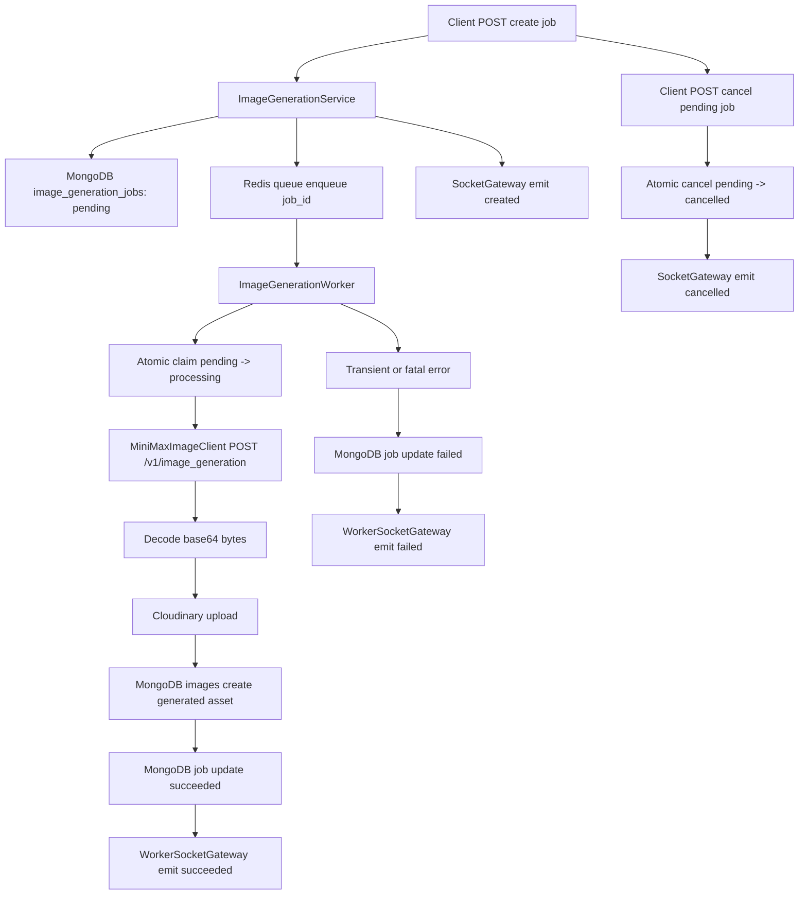

## Context

The platform already supports organization-scoped image storage through Cloudinary, asynchronous work through Redis-backed workers, and real-time user-targeted updates through Socket.IO. What is missing is a durable text-to-image generation workflow that fits those existing patterns instead of holding a long HTTP request open while an external provider works.

This change introduces a new backend job domain for MiniMax text-to-image generation. MiniMax's image API is documented as a synchronous `POST /v1/image_generation` call, but the platform needs asynchronous orchestration for four reasons:

1. provider latency and rate limits should not block the original request
2. generation history must be queryable after the request is finished
3. frontend should receive lifecycle updates through the existing Socket.IO channel
4. a user must be able to cancel a job before processing begins

The current stack already gives us most of the building blocks:

- `app/infrastructure/redis/redis_queue.py` provides FIFO queue operations
- `app/workers/sheet_sync_worker.py` establishes the worker pattern for queued execution
- `app/socket_gateway/__init__.py` and `app/socket_gateway/worker_gateway.py` already support server-side and worker-side user-targeted socket emission
- `app/common/socket_payload_contract.py` already enriches outbound socket payloads with additive `organization_id`
- `app/api/v1/images/router.py`, `app/services/image/image_service.py`, and `app/repo/image_repo.py` already model authenticated image persistence and retrieval

Key constraints for this design:

- Phase 1 supports `text-to-image` only, not image-to-image
- Each job generates exactly one image
- MiniMax output is requested as `base64`, not temporary provider URLs
- Generation history is stored durably in MongoDB
- Cancel is supported only while a job remains `pending`
- Real-time delivery should reuse the existing Socket.IO infrastructure rather than introduce a second realtime transport
- The current Redis queue implementation uses a list, which makes arbitrary removal of a queued item difficult; cancellation must therefore be modeled primarily in persistent job state, not by assuming physical queue removal

## Goals / Non-Goals

**Goals:**
- Add a durable `text-to-image` job lifecycle with persistent MongoDB history
- Keep HTTP create requests fast by enqueuing work instead of waiting on MiniMax
- Store generated images through the existing authenticated Cloudinary-backed image model
- Expose job status through REST and lifecycle notifications through Socket.IO
- Allow a user to cancel a job while it is still `pending`
- Preserve organization-scoped access control and payload contracts used elsewhere in the platform
- Keep the design extensible for future support of retries, multiple outputs, or additional image providers

**Non-Goals:**
- Image-to-image generation
- More than one generated image per job
- Mid-flight cancellation after a worker has already claimed the job
- Priority queues, scheduled jobs, or pause/resume semantics
- Provider failover across multiple image vendors
- Public image delivery or direct exposure of MiniMax output URLs/base64 to clients
- A new frontend-specific websocket protocol beyond the existing Socket.IO channel

## Decisions

### D1: Model generation as a first-class job resource

**Decision:** Introduce a dedicated `image_generation_jobs` collection and treat generation as a separate domain from stored images.

**Rationale:** A generated image is the final asset, but the business entity is the job itself. A job has a lifecycle, provider metadata, retries, cancellation semantics, timestamps, and failure information that do not belong in the `images` collection. Keeping jobs separate also makes list/history APIs and worker logic much cleaner.

**Proposed job document shape:**

```json
{
  "_id": "ObjectId",
  "organization_id": "string",
  "created_by": "string",
  "type": "text_to_image",
  "provider": "minimax",
  "provider_model": "image-01",
  "status": "pending|processing|succeeded|failed|cancelled",
  "prompt": "string",
  "aspect_ratio": "1:1|16:9|4:3|3:2|2:3|3:4|9:16|21:9",
  "seed": 12345,
  "prompt_optimizer": false,
  "requested_count": 1,
  "retry_count": 0,
  "provider_trace_id": "string|null",
  "output_image_ids": ["string"],
  "success_count": 0,
  "failed_count": 0,
  "error_code": "string|null",
  "error_message": "string|null",
  "requested_at": "datetime",
  "started_at": "datetime|null",
  "completed_at": "datetime|null",
  "cancelled_at": "datetime|null",
  "deleted_at": "datetime|null"
}
```

**Indexes:**
- `{ organization_id: 1, requested_at: -1, deleted_at: 1 }`
- `{ created_by: 1, organization_id: 1, requested_at: -1, deleted_at: 1 }`
- `{ status: 1, requested_at: -1, deleted_at: 1 }`

**Alternatives considered:**
- Extend `images` to also store job state: rejected because job lifecycle and image asset metadata evolve independently
- Use Redis-only ephemeral jobs: rejected because persistent history is a hard requirement

### D2: Use a separate API resource for generation jobs

**Decision:** Expose generation jobs under a dedicated route group, e.g. `POST /api/v1/image-generations/text-to-image`, `GET /api/v1/image-generations/{job_id}`, `GET /api/v1/image-generations`, and `POST /api/v1/image-generations/{job_id}/cancel`.

**Rationale:** Jobs are not images; they are orchestration resources that may or may not eventually produce images. A dedicated route group keeps responsibilities clean:

- `/api/v1/images/*` continues to mean persisted image assets
- `/api/v1/image-generations/*` means generation lifecycle

This separation also avoids overloading the existing image router with queue and worker semantics.

**Alternatives considered:**
- Nest generation under `/api/v1/images/generations`: acceptable, but conflates asset management and job orchestration
- Put generation under `/api/v1/ai`: rejected because the output assets are image-domain resources and need image-specific history and permissions

### D3: Use Redis queue for execution, MongoDB state as the source of truth

**Decision:** Queue payloads will be minimal and Redis will only signal work availability. Authoritative job state lives in MongoDB.

**Queue payload shape:**

```json
{
  "job_id": "string",
  "organization_id": "string",
  "user_id": "string",
  "queued_at": "datetime",
  "retry_count": 0
}
```

**Rationale:** The current Redis queue implementation is a FIFO list with `rpush`/`lpop` or `blpop`. That queue is good for dispatching work, but it is not a reliable place to store job lifecycle state or support rich queries. Using MongoDB as the source of truth makes cancellation, list/history, and stale queue handling tractable.

This also gives us safe behavior when a queue item is stale:
- if the job was cancelled while still waiting in Redis, the worker reads the payload, loads the DB record, sees `status=cancelled`, and drops it without processing
- if a duplicate queue payload appears, the worker can no-op based on job state

**Alternatives considered:**
- Store full job state in Redis only: rejected because history is required and queue messages are not query-friendly
- Use MongoDB polling instead of Redis queue: rejected because it is less responsive and creates constant DB polling load

### D4: Cancellation is a state transition, not a queue deletion feature

**Decision:** Implement cancellation as an atomic compare-and-set transition from `pending` to `cancelled`. Do not depend on physically removing the message from the Redis list.

**Rationale:** Redis lists do not provide an efficient, robust pattern for removing an arbitrary queued job in this current queue abstraction. Even if physical removal were attempted, race conditions would remain. The reliable model is:

- API cancel path updates the job only if its current status is `pending`
- Worker claim path updates the job only if its current status is `pending`
- exactly one of those compare-and-set operations wins

This produces the intended business rule:
- if cancel wins first, the job is cancelled and the later dequeued payload is ignored
- if worker claim wins first, the job is already processing and cancel is rejected

**Required repository methods:**
- `claim_pending_job(job_id) -> job | None`
- `cancel_pending_job(job_id, user_id, organization_id) -> job | None`

Both methods must be single-document atomic updates in MongoDB.

**Alternatives considered:**
- Support cancelling `processing` jobs too: rejected for phase 1 because MiniMax sync HTTP calls are not cancellable in a reliable provider-aware way once dispatched
- Remove queued items directly from Redis: rejected because it complicates queue semantics and does not eliminate claim/cancel races

### D5: Keep the job state machine small and explicit

**Decision:** Use a simple phase 1 state machine:

```text
pending -> processing -> succeeded
pending -> processing -> failed
pending -> cancelled
```

Optional future retry behavior can requeue a failed or transiently failed job, but phase 1 state semantics remain centered on the states above.

**Rationale:** The user-facing behavior is clear and maps cleanly to the cancellation rule. Because each job only generates one image, we do not need `partial_success` yet. Avoiding extra statuses such as `retrying`, `queued`, or `completed_with_warnings` keeps both API and socket contracts simpler.

**Alternatives considered:**
- Add `retrying` and `partial_success` immediately: rejected because `n=1` makes them unnecessary for phase 1
- Use `created` and `queued` as separate statuses: rejected because they do not materially help clients

### D6: Use a dedicated MiniMax image client and request `base64`

**Decision:** Add a dedicated infrastructure client for MiniMax image generation, separate from the current voice/TTS client, and always request `response_format=base64`.

**Rationale:** Image generation has different payloads, timeout expectations, and normalization logic from voice/TTS. A dedicated client keeps responsibilities focused and avoids turning the current MiniMax client into a catch-all provider wrapper.

Choosing `base64` over `url` is intentional:
- avoids a second fetch hop from temporary provider URLs
- avoids dependence on 24-hour provider URL expiry
- gives the worker deterministic bytes that can be uploaded immediately to Cloudinary

**Normalized provider result shape:**
- `provider_trace_id`
- `images_base64`
- `success_count`
- `failed_count`
- `raw`

Even though phase 1 only accepts one image, the normalized provider result should still allow a list internally so the design can grow cleanly later.

**Alternatives considered:**
- Extend the existing `MiniMaxClient` with image methods: acceptable, but less clean over time
- Request provider URLs instead of base64: rejected for phase 1 because it adds an unnecessary fetch-and-expiry dependency

### D7: Persist generated outputs through the existing image asset model

**Decision:** After provider success, decode the first returned base64 image, upload it to Cloudinary through the existing image storage path, and store the output in `images` with additive generation metadata.

**Recommended additive image fields:**
- `source`: `upload` | `generation`
- `generation_job_id`: optional string
- `provider`: optional string
- `provider_model`: optional string

**Rationale:** The platform already has a working, authenticated image access model. Reusing it avoids a second asset storage system and keeps all image retrieval under the same signed URL and permission model. The job record points to output image IDs; the image record stays the canonical metadata record for the asset itself.

**Alternatives considered:**
- Separate `generated_images` collection: rejected because it duplicates image storage concerns
- Return raw provider base64 directly to the client and skip persistence: rejected because durable history is required

### D8: Use Socket.IO lifecycle events on the existing user-room model

**Decision:** Emit text-to-image lifecycle events through the existing Socket.IO infrastructure and existing `user:{user_id}` room targeting. Use top-level `organization_id` through the existing payload enrichment helper.

**Proposed event family:**
- `image:generation:created`
- `image:generation:processing`
- `image:generation:succeeded`
- `image:generation:failed`
- `image:generation:cancelled`

**Payload baseline:**

```json
{
  "job_id": "string",
  "status": "pending|processing|succeeded|failed|cancelled",
  "organization_id": "string",
  "requested_count": 1,
  "success_count": 0,
  "failed_count": 0,
  "error_message": null,
  "image_ids": []
}
```

**Emission strategy:**
- API/server process emits `created` and `cancelled` through `gateway.emit_to_user(...)`
- Worker emits `processing`, `succeeded`, and `failed` through `worker_gateway.emit_to_user(...)`

**Rationale:** This aligns with the existing socket architecture and the already-established `organization_id` enrichment contract. It also keeps the API usable with polling-only clients while enabling realtime UX immediately.

**Alternatives considered:**
- Introduce a new websocket endpoint for generation only: rejected because Socket.IO infrastructure already exists and fits lifecycle notifications well
- Emit to organization rooms: rejected for phase 1 because current routing is user-scoped across the codebase

### D9: Keep REST and socket contracts complementary, not redundant

**Decision:** REST remains the source for durable reads; socket events are notifications, not the only state channel.

Concretely:
- `POST create` returns the new job immediately
- `GET detail` returns authoritative, current state and generated image references
- `GET list` returns paginated history
- socket events notify clients that they should update local state or refetch

**Rationale:** Sockets are excellent for UX responsiveness but poor as the only source of truth. Durable reads must still work for clients that reconnect, refresh, or miss events. This also simplifies frontend state reconciliation.

**List/detail split:**
- list responses should return job summaries without generating signed image URLs for every historical record
- detail responses may include signed image URLs for completed outputs because they are used interactively

**Alternatives considered:**
- Put signed URLs on every history item: rejected because it adds unnecessary signing work and creates short-lived URLs that may expire before use
- Rely on socket events only: rejected because history and refresh resilience are required

### D10: Use optimistic event ordering with authoritative DB writes first

**Decision:** Persist the state transition first, then emit the socket event derived from the persisted state.

**Rationale:** The primary consistency requirement is that any client refetch after receiving an event sees the same state in the database. Writing to MongoDB first and emitting second preserves that ordering. This matters especially for:
- `cancelled`
- `processing`
- `succeeded`
- `failed`

**Alternatives considered:**
- Emit before writing: rejected because clients could receive an event and immediately refetch stale data

### D11: Treat provider errors as categorized domain failures

**Decision:** Normalize MiniMax and transport errors into application-level categories:

- `retryable provider/transient`
- `non-retryable validation/content/account`

For phase 1 design, the job document keeps `error_code`, `error_message`, and `retry_count`, even if implementation initially chooses conservative retry behavior.

**Recommended mapping direction:**
- retryable: transport timeout, network error, provider timeout, provider rate limit, temporary internal provider errors
- non-retryable: invalid prompt parameters, sensitive prompt rejection, invalid API key, insufficient account balance

**Rationale:** Even if the first implementation keeps retries minimal, the persistence model should not paint us into a corner. The history record needs to explain why a job failed, and future worker improvements should not require a schema redesign.

### D12: Add a dedicated worker instead of reusing HTTP background tasks

**Decision:** Create a dedicated `image_generation_worker.py` modeled after the sheet sync worker instead of using FastAPI `BackgroundTasks`.

**Rationale:** `BackgroundTasks` are tied to the lifecycle of the app process that served the request and are a poor fit for provider-bound, history-bearing, cancellable jobs. A dedicated worker gives better isolation, more predictable scaling, and cleaner operational boundaries.

**Alternatives considered:**
- FastAPI `BackgroundTasks`: rejected because the work is durable and belongs in the queue/worker model
- Run generation inline in the API request and only emit socket events: rejected because it defeats the point of the job architecture

## Architecture Overview



## File Structure

```text
app/
├── api/v1/
│   ├── image_generations/
│   │   ├── __init__.py
│   │   └── router.py
│   └── router.py
├── common/
│   ├── event_socket.py
│   ├── exceptions.py
│   ├── repo.py
│   └── service.py
├── config/
│   └── settings.py
├── domain/models/
│   ├── image.py
│   └── image_generation_job.py
├── domain/schemas/
│   ├── image.py
│   └── image_generation.py
├── infrastructure/minimax/
│   ├── client.py
│   └── image_client.py
├── repo/
│   ├── image_repo.py
│   └── image_generation_job_repo.py
├── services/image/
│   ├── image_service.py
│   └── image_generation_service.py
└── workers/
    └── image_generation_worker.py
```

## Risks / Trade-offs

- **[Cancelled jobs may remain physically present in Redis until dequeued]** -> This is acceptable because MongoDB state is authoritative. Mitigation: worker always checks current job state before processing and silently drops cancelled or terminal jobs.
- **[Cancel and worker-claim can race]** -> Only one side should win. Mitigation: use atomic compare-and-set updates from `pending` to `cancelled` or `pending` to `processing`; return conflict if cancel loses.
- **[MiniMax base64 responses increase payload size]** -> Response bodies are larger than URL-based responses. Mitigation: phase 1 generates only one image per job and immediately persists the decoded bytes instead of keeping them around.
- **[Socket events can be missed by disconnected clients]** -> Realtime is additive, not authoritative. Mitigation: job detail and history endpoints remain the durable source of truth.
- **[Global MiniMax API key shares quota across all organizations]** -> One noisy organization can affect others. Mitigation: keep queue-based orchestration, store retry/error data, and leave room for future per-org throttling.
- **[List endpoints can become expensive with long-lived history]** -> History grows over time. Mitigation: paginate by default, index by organization and time, and avoid signed URL generation on list endpoints.
- **[Reusing the existing images collection introduces additive schema complexity]** -> Image records now represent both uploads and generated assets. Mitigation: keep generated-specific fields optional and additive, and preserve backward compatibility for existing image APIs.

## Migration Plan

1. Add the new job model, schema, repository, and queue setting without changing existing image APIs
2. Add the dedicated image generation router and worker implementation
3. Add new socket event constants and emit paths using the existing gateway and worker gateway
4. Create MongoDB indexes for `image_generation_jobs` and any new `images` fields such as `generation_job_id`
5. Deploy server code before or alongside worker code so create/list/detail/cancel endpoints can safely persist jobs even if processing starts slightly later
6. Start the worker process and verify end-to-end event delivery, queue consumption, and Cloudinary persistence
7. **Rollback**: stop the worker, remove the generation router from the API mount, and disable job creation. Existing job and image records may remain in MongoDB and Cloudinary without affecting current image upload behavior

## Open Questions

- None blocking at this time. The current design intentionally fixes phase 1 scope to `text-to-image`, single output, `base64` provider responses, pending-only cancellation, and Socket.IO lifecycle events.
